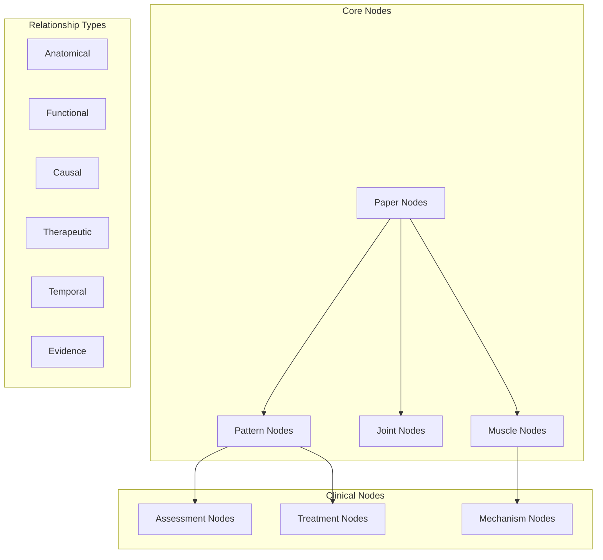

# 🕸️ Node Connector API

> **Knowledge graph construction API for compensation research concepts and relationships**

## 🎯 Overview

The Node Connector API builds intelligent knowledge graphs that connect compensation patterns, anatomical structures, assessments, and treatments. It creates meaningful relationships between research concepts to support clinical decision-making and knowledge discovery.

## 🧩 Knowledge Graph Structure

### **Node Architecture**



## 📚 API Reference

### **Class: CompensationNodeConnector**

#### **Constructor**
```python
CompensationNodeConnector(
    connection_threshold: float = 0.15,
    max_connections_per_node: int = 20,
    evidence_weight: float = 0.4,
    clinical_weight: float = 0.3,
    debug: bool = False
)
```

**Parameters:**
- `connection_threshold`: Minimum strength for connection inclusion
- `max_connections_per_node`: Limit to prevent overcrowding
- `evidence_weight`: Weight for evidence-based connections
- `clinical_weight`: Weight for clinical relevance
- `debug`: Enable detailed connection logging

#### **Primary Methods**

##### **build_knowledge_graph()**
```python
def build_knowledge_graph(self, nodes: List[Node]) -> Graph:
    """
    Construct complete knowledge graph from analyzed nodes

    Args:
        nodes: List of Node objects from paper analyses

    Returns:
        Graph object with nodes and weighted connections

    Example:
        connector = CompensationNodeConnector()
        graph = connector.build_knowledge_graph(nodes)

        print(f"Nodes: {len(graph.nodes)}")
        print(f"Connections: {len(graph.edges)}")
        print(f"Average connections per node: {graph.average_degree}")
    """
```

**Graph Structure:**
```python
@dataclass
class Graph:
    nodes: Dict[str, Node]
    edges: List[Edge]
    metadata: GraphMetadata

@dataclass
class Node:
    id: str
    type: NodeType
    name: str
    properties: Dict[str, Any]
    connections: List[str]  # Connected node IDs

@dataclass
class Edge:
    source_id: str
    target_id: str
    connection_type: ConnectionType
    strength: float
    evidence_support: List[str]  # Supporting paper IDs
    clinical_relevance: float
```

##### **create_nodes_from_analyses()**
```python
def create_nodes_from_analyses(self, analyses: List[FiveWhyAnalysis]) -> List[Node]:
    """
    Extract and create nodes from 5WHY paper analyses

    Node Extraction Strategy:
    - Anatomical structures mentioned in analyses
    - Compensation patterns identified
    - Assessment methods referenced
    - Treatment approaches described
    - Physiological mechanisms explained

    Returns:
        List of Node objects ready for graph construction
    """
```

**Node Types:**
```python
class NodeType(Enum):
    PAPER = "paper"
    MUSCLE = "muscle"
    JOINT = "joint"
    PATTERN = "compensation_pattern"
    ASSESSMENT = "clinical_assessment"
    TREATMENT = "intervention"
    MECHANISM = "physiological_mechanism"
    CONDITION = "clinical_condition"
```

##### **calculate_connection_strength()**
```python
def calculate_connection_strength(self, source_node: Node, target_node: Node) -> float:
    """
    Calculate weighted connection strength between two nodes

    Scoring Components:
    - Anatomical proximity (0.0-0.3)
    - Functional relationship (0.0-0.3)
    - Evidence support (0.0-0.4)
    - Clinical co-occurrence (0.0-0.3)

    Total possible: 1.3, capped at 1.0

    Returns:
        Connection strength score (0.0-1.0)
    """
```

**Connection Strength Examples:**
```yaml
Strong Connections (0.70-1.00):
  - Gluteus Medius ↔ Hip Abduction Pattern (0.85)
  - TFL Overactivity ↔ IT Band Syndrome (0.78)
  - Single Leg Squat ↔ Hip Stability Assessment (0.82)

Moderate Connections (0.50-0.69):
  - Hip Weakness ↔ Knee Valgus (0.62)
  - Core Instability ↔ Low Back Pain (0.58)
  - Ankle Instability ↔ Hip Compensation (0.54)

Weak Connections (0.30-0.49):
  - Shoulder Dysfunction ↔ Hip Pattern (0.38)
  - Breathing Pattern ↔ Core Function (0.42)
  - Jaw Tension ↔ Cervical Position (0.35)
```

##### **identify_connection_type()**
```python
def identify_connection_type(self, source_node: Node, target_node: Node) -> ConnectionType:
    """
    Classify the type of relationship between nodes

    Connection Types:
    - ANATOMICAL: Physical/structural relationships
    - FUNCTIONAL: Movement/performance relationships
    - CAUSAL: Cause-and-effect relationships
    - THERAPEUTIC: Treatment-related relationships
    - TEMPORAL: Time-sequence relationships
    - EVIDENCE: Research support relationships

    Returns:
        ConnectionType enum value
    """
```

### **Specialized Analysis Methods**

##### **analyze_compensation_networks()**
```python
def analyze_compensation_networks(self, graph: Graph) -> Dict:
    """
    Identify compensation pattern networks and clusters

    Analysis Components:
    - Primary compensation hubs
    - Secondary effect clusters
    - Treatment pathway networks
    - Assessment correlation groups

    Returns:
        {
            "compensation_hubs": [
                {
                    "node_id": "gluteus_medius_weakness",
                    "connection_count": 15,
                    "influence_score": 0.78,
                    "connected_patterns": ["TFL_substitution", "hip_drop", "knee_valgus"]
                }
            ],
            "cluster_analysis": [
                {
                    "cluster_name": "hip_abductor_dysfunction",
                    "nodes": ["gluteus_medius", "gluteus_minimus", "TFL"],
                    "cluster_coherence": 0.85
                }
            ]
        }
    """
```

##### **find_treatment_pathways()**
```python
def find_treatment_pathways(self, graph: Graph, start_condition: str) -> List[Dict]:
    """
    Identify optimal treatment pathways through the knowledge graph

    Pathway Analysis:
    - Shortest path from condition to treatment
    - Evidence-weighted pathways
    - Clinical effectiveness routes
    - Alternative treatment options

    Returns:
        [
            {
                "pathway_id": "glut_med_weakness_tx",
                "start_node": "gluteus_medius_weakness",
                "end_node": "progressive_strengthening",
                "path_nodes": ["assessment", "motor_control", "strengthening"],
                "pathway_strength": 0.82,
                "evidence_level": "Level_A",
                "expected_outcomes": ["strength_improvement", "function_restoration"]
            }
        ]
    """
```

##### **detect_pattern_emergence()**
```python
def detect_pattern_emergence(self, graph: Graph) -> List[Dict]:
    """
    Identify emerging compensation patterns from node connections

    Emergence Detection:
    - Novel node combinations
    - Unexpected strong connections
    - Cross-system relationships
    - Treatment innovation opportunities

    Returns:
        [
            {
                "pattern_name": "respiratory_hip_connection",
                "nodes_involved": ["diaphragm", "psoas", "hip_flexor_tightness"],
                "novelty_score": 0.65,
                "clinical_potential": "moderate",
                "research_gaps": ["breathing_movement_interaction"]
            }
        ]
    """
```

## 🔗 Connection Algorithms

### **Anatomical Proximity Algorithm**
```python
def calculate_anatomical_proximity(self, node1: Node, node2: Node) -> float:
    """
    Calculate anatomical connection strength

    Proximity Factors:
    - Direct anatomical connection (0.25-0.30)
    - Fascial chain relationship (0.15-0.20)
    - Kinetic chain connection (0.10-0.15)
    - Regional proximity (0.05-0.10)

    Clinical Examples:
        Gluteus Medius ↔ Hip Joint = 0.30 (direct)
        TFL ↔ IT Band = 0.28 (direct)
        Hip ↔ Knee = 0.15 (kinetic chain)
        Shoulder ↔ Hip = 0.08 (regional)
    """
```

### **Functional Similarity Algorithm**
```python
def calculate_functional_similarity(self, node1: Node, node2: Node) -> float:
    """
    Calculate functional relationship strength

    Function Categories:
    - Primary function sharing (0.25-0.30)
    - Compensation relationship (0.20-0.25)
    - Synergistic function (0.15-0.20)
    - Movement system overlap (0.10-0.15)

    Examples:
        Gluteus Medius ↔ Hip Abduction = 0.30 (primary)
        TFL ↔ Gluteus Medius Compensation = 0.25 (compensation)
        Core ↔ Hip Stability = 0.20 (synergistic)
    """
```

### **Evidence Support Algorithm**
```python
def calculate_evidence_support(self, node1: Node, node2: Node) -> float:
    """
    Calculate evidence-based connection strength

    Evidence Levels:
    - Multiple high-quality papers (0.30-0.40)
    - Some supporting evidence (0.20-0.30)
    - Limited research support (0.10-0.20)
    - Theoretical relationship (0.05-0.10)

    Weight Factors:
    - Paper quality scores
    - Number of supporting studies
    - Consistency of findings
    - Recency of evidence
    """
```

## 🎯 Clinical Applications

### **Differential Diagnosis Networks**
```python
def build_diagnosis_network(self, symptoms: List[str]) -> Graph:
    """
    Create diagnostic network from symptom presentation

    Example Usage:
        symptoms = ["hip_drop", "knee_valgus", "ankle_pronation"]
        dx_network = connector.build_diagnosis_network(symptoms)

        # Identify most likely patterns
        likely_patterns = dx_network.get_highest_probability_nodes()
        print(f"Most likely: {likely_patterns[0].name}")
    """
```

### **Treatment Protocol Networks**
```python
def generate_treatment_network(self, compensation_pattern: str) -> Graph:
    """
    Create treatment protocol network for specific compensation

    Network Components:
    - Assessment protocols
    - Treatment progressions
    - Outcome measures
    - Alternative approaches

    Returns:
        Graph showing evidence-based treatment pathways
    """
```

### **Research Gap Identification**
```python
def identify_research_gaps(self, graph: Graph) -> List[Dict]:
    """
    Identify underexplored connections and research opportunities

    Gap Analysis:
    - Weak connections with clinical importance
    - Missing evidence for common patterns
    - Novel relationship hypotheses
    - Treatment effectiveness gaps

    Returns:
        [
            {
                "gap_type": "weak_evidence",
                "connection": "breathing_pattern ↔ hip_function",
                "clinical_importance": "high",
                "research_priority": "medium",
                "suggested_study_design": "cross_sectional_correlation"
            }
        ]
    """
```

## 📊 Graph Analytics

### **Network Metrics**
```python
def calculate_network_metrics(self, graph: Graph) -> Dict:
    """
    Calculate comprehensive network analysis metrics

    Returns:
        {
            "node_statistics": {
                "total_nodes": 450,
                "node_types": {
                    "muscle": 45,
                    "joint": 25,
                    "pattern": 35,
                    "assessment": 40,
                    "treatment": 55
                }
            },
            "connection_statistics": {
                "total_connections": 1250,
                "average_strength": 0.42,
                "strength_distribution": {
                    "strong": 125,
                    "moderate": 380,
                    "weak": 745
                }
            },
            "network_properties": {
                "density": 0.12,
                "clustering_coefficient": 0.68,
                "average_path_length": 3.2,
                "modularity": 0.75
            }
        }
    """
```

### **Centrality Analysis**
```python
def analyze_node_centrality(self, graph: Graph) -> Dict:
    """
    Identify the most important nodes in the network

    Centrality Measures:
    - Degree centrality (connection count)
    - Betweenness centrality (pathway importance)
    - Eigenvector centrality (influence score)
    - Clinical relevance centrality

    Returns:
        {
            "most_connected": [
                {"node": "gluteus_medius", "connections": 23},
                {"node": "hip_stability", "connections": 19}
            ],
            "pathway_hubs": [
                {"node": "core_stability", "betweenness": 0.45},
                {"node": "movement_screen", "betweenness": 0.38}
            ],
            "influence_leaders": [
                {"node": "5WHY_methodology", "eigenvector": 0.82},
                {"node": "compensation_theory", "eigenvector": 0.76}
            ]
        }
    """
```

## 🔄 Graph Optimization

### **Connection Pruning**
```python
def optimize_graph_structure(self, graph: Graph) -> Graph:
    """
    Optimize graph for clinical utility and performance

    Optimization Strategies:
    - Remove weak connections below threshold
    - Eliminate redundant pathways
    - Strengthen clinically important connections
    - Balance node connection density

    Returns:
        Optimized Graph object with improved structure
    """
```

### **Clinical Relevance Weighting**
```python
def apply_clinical_weighting(self, graph: Graph) -> Graph:
    """
    Boost connections based on clinical importance

    Clinical Priority Factors:
    - Common compensation patterns (+20%)
    - Evidence-based treatments (+30%)
    - Validated assessments (+15%)
    - High-impact interventions (+25%)

    Returns:
        Graph with clinically weighted connections
    """
```

## 🚨 Quality Assurance

### **Connection Validation**
```python
def validate_connections(self, graph: Graph) -> Dict:
    """
    Validate connection quality and clinical accuracy

    Validation Checks:
    - Anatomical accuracy verification
    - Clinical logic consistency
    - Evidence support adequacy
    - Expert review flags

    Returns:
        {
            "validation_score": 0.87,
            "flagged_connections": [
                {
                    "connection": "jaw_tension ↔ hip_dysfunction",
                    "flag_reason": "weak_evidence",
                    "recommendation": "expert_review"
                }
            ],
            "quality_metrics": {
                "anatomical_accuracy": 0.92,
                "clinical_consistency": 0.88,
                "evidence_support": 0.84
            }
        }
    """
```

## 🔗 Integration Examples

### **With 5WHY Analyzer**
```python
from why_analyzer import CompensationWhyAnalyzer
from node_connector import CompensationNodeConnector

analyzer = CompensationWhyAnalyzer()
connector = CompensationNodeConnector()

# Analyze papers and build graph
analyses = [analyzer.analyze_paper(paper) for paper in papers]
nodes = connector.create_nodes_from_analyses(analyses)
graph = connector.build_knowledge_graph(nodes)

# Find treatment pathways
pathways = connector.find_treatment_pathways(graph, "gluteus_medius_weakness")
```

### **With Obsidian Generator**
```python
from obsidian_generator import CompensationObsidianGenerator

connector = CompensationNodeConnector()
generator = CompensationObsidianGenerator()

graph = connector.build_knowledge_graph(nodes)
obsidian_vault = generator.create_vault_from_graph(graph)
```

---

**🕸️ The Node Connector API creates intelligent knowledge graphs that reveal hidden relationships in compensation research, supporting evidence-based clinical decision-making and knowledge discovery.**