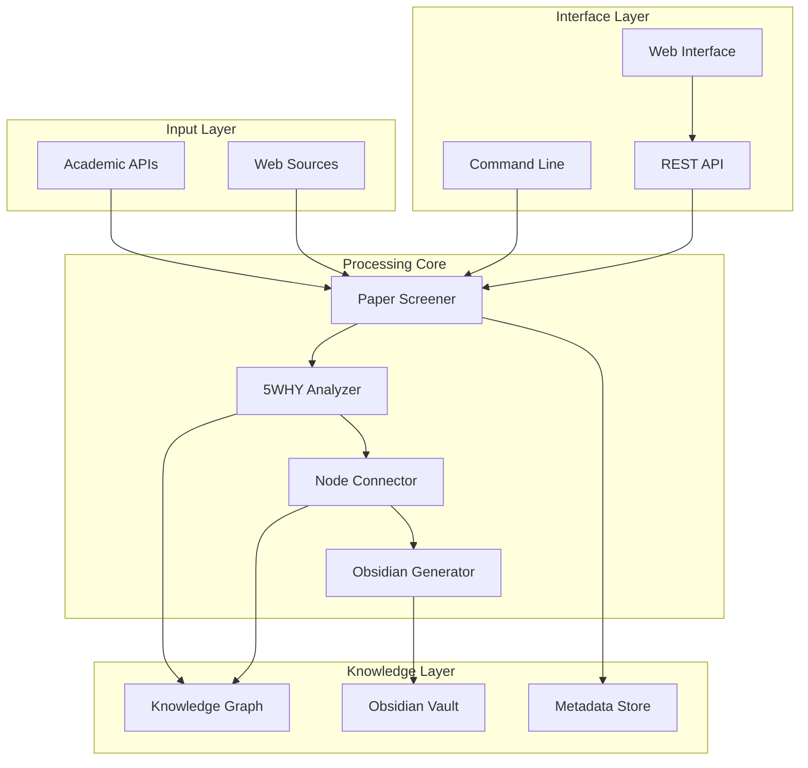
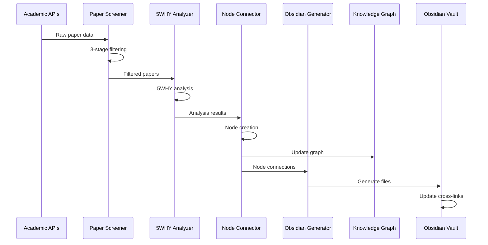

# 🧩 Component Architecture

> **Detailed breakdown of system components and their relationships**

## 🎯 Component Overview

The Compensation Research System consists of four core components working in harmony to transform raw academic papers into actionable clinical knowledge.



## 📋 Core Components

### **1. Paper Screener** (`paper_screener.py`)

**Purpose**: Intelligent filtering and quality assessment of academic papers

#### **Input Sources**
```yaml
Primary APIs:
  - OpenAlex: Open academic graph
  - PubMed: Medical literature database
  - CrossRef: Academic metadata

Data Format:
  - JSON responses from REST APIs
  - Structured metadata with abstracts
  - Citation and impact metrics
```

#### **Processing Pipeline**
```python
class CompensationPaperScreener:
    def screen_papers(self, limit: int) -> List[Dict]:
        # Stage 1: Field Specialization Filter
        raw_papers = self.search_papers(limit * 5)
        field_filtered = self.filter_by_field_specialization(raw_papers)

        # Stage 2: Research Quality Filter
        quality_filtered = self.filter_by_research_quality(field_filtered)

        # Stage 3: Compensation Relevance Filter
        final_filtered = self.filter_by_compensation_relevance(quality_filtered)

        return final_filtered[:limit]
```

#### **Quality Metrics**
```yaml
Field Specialization (Stage 1):
  - Journal Impact Factor: 0-10 points
  - Compensation Keywords: 0-5 points
  - Anatomical Relevance: 0-3 points
  - Exclusion Penalties: -2 points per exclusion keyword

Research Quality (Stage 2):
  - Study Design: 1-10 points (RCT=10, Case Report=1)
  - Sample Size: 0-5 points (>100 participants=5)
  - Citation Impact: 0-10 points (normalized by age)
  - Institution Count: 0-3 points (multi-center bonus)

Compensation Relevance (Stage 3):
  - 5WHY Potential: 0-8 points
  - Assessment Methods: 0-6 points
  - Intervention Approaches: 0-6 points
  - Pattern Specificity: 0-10 points
```

#### **Output Format**
```json
{
  "paper_id": "openalex:W1234567890",
  "screening_scores": {
    "field_score": 7.5,
    "quality_score": 8.2,
    "relevance_score": 6.8,
    "total_score": 22.5
  },
  "metadata": {
    "title": "Paper title",
    "authors": ["Author 1", "Author 2"],
    "journal": "Journal Name",
    "year": 2023,
    "doi": "10.xxxx/xxxx"
  },
  "compensation_indicators": {
    "primary_region": "hip",
    "dysfunction_type": "weakness",
    "compensation_mechanism": "substitution"
  }
}
```

### **2. 5WHY Analyzer** (`why_analyzer.py`)

**Purpose**: Extract causal relationships using 5WHY methodology

#### **Analysis Framework**
```python
@dataclass
class FiveWhyAnalysis:
    paper_title: str
    why_levels: List[WhyLevel]
    compensation_pattern: CompensationPattern
    clinical_significance: str
    key_message: str
    treatment_keypoints: List[str]
    confidence_score: float
    evidence_strength: str
```

#### **WHY Level Structure**
```python
@dataclass
class WhyLevel:
    level: int                    # 1-5
    question: str                # WHY question
    answer: str                  # Identified cause
    evidence: str                # Supporting evidence
    confidence: float            # 0.0-1.0
    compensation_type: str       # substitution, adaptation, etc.
    anatomical_focus: List[str]  # Affected structures
```

#### **Pattern Recognition Engine**
```python
class CompensationPattern:
    def identify_pattern(self, text: str) -> CompensationPattern:
        # 1. Muscle Dysfunction Detection
        weakness_patterns = self._detect_weakness_patterns(text)
        overactivity_patterns = self._detect_overactivity_patterns(text)

        # 2. Causal Chain Construction
        causal_chain = self._build_causal_chain(weakness_patterns, overactivity_patterns)

        # 3. Clinical Context Integration
        clinical_context = self._extract_clinical_context(text)

        # 4. Pattern Classification
        pattern_type = self._classify_compensation_type(causal_chain)

        return CompensationPattern(
            name=self._generate_pattern_name(causal_chain),
            primary_dysfunction=weakness_patterns[0] if weakness_patterns else None,
            compensatory_strategy=overactivity_patterns[0] if overactivity_patterns else None,
            mechanism=pattern_type,
            clinical_context=clinical_context
        )
```

#### **Evidence Classification**
```yaml
Level A Evidence (High Confidence):
  - Controlled experimental studies
  - Direct biomechanical measurements (EMG, motion analysis)
  - Systematic reviews and meta-analyses

Level B Evidence (Moderate Confidence):
  - Observational studies with controls
  - Clinical assessment findings
  - Expert consensus statements

Level C Evidence (Supporting):
  - Case studies and case series
  - Theoretical models and hypotheses
  - Clinical experience reports
```

### **3. Node Connector** (`node_connector.py`)

**Purpose**: Build knowledge graph connections between compensation concepts

#### **Node Types**
```python
class NodeType(Enum):
    PAPER = "paper"
    MUSCLE = "muscle"
    JOINT = "joint"
    PATTERN = "compensation_pattern"
    ASSESSMENT = "clinical_assessment"
    TREATMENT = "intervention"
    MECHANISM = "physiological_mechanism"
```

#### **Connection Types**
```python
class ConnectionType(Enum):
    ANATOMICAL = "anatomical_relationship"
    FUNCTIONAL = "functional_relationship"
    CAUSAL = "causal_relationship"
    THERAPEUTIC = "therapeutic_relationship"
    TEMPORAL = "temporal_sequence"
    EVIDENCE = "evidence_support"
```

#### **Connection Strength Calculation**
```python
def calculate_connection_strength(self, source_node: Node, target_node: Node) -> float:
    """Calculate connection strength between two nodes"""

    # Anatomical proximity (0.0-0.3)
    anatomical_score = self._calculate_anatomical_proximity(source_node, target_node)

    # Functional relationship (0.0-0.3)
    functional_score = self._calculate_functional_similarity(source_node, target_node)

    # Evidence support (0.0-0.4)
    evidence_score = self._calculate_evidence_support(source_node, target_node)

    # Clinical co-occurrence (0.0-0.3)
    cooccurrence_score = self._calculate_clinical_cooccurrence(source_node, target_node)

    total_strength = (anatomical_score + functional_score +
                     evidence_score + cooccurrence_score)

    return min(total_strength, 1.0)
```

#### **Graph Construction Algorithm**
```python
def build_knowledge_graph(self, nodes: List[Node]) -> Graph:
    """Build complete knowledge graph from analyzed nodes"""

    graph = Graph()

    # 1. Add all nodes
    for node in nodes:
        graph.add_node(node)

    # 2. Calculate all possible connections
    for i, source in enumerate(nodes):
        for target in nodes[i+1:]:
            strength = self.calculate_connection_strength(source, target)

            if strength >= self.connection_threshold:
                connection_type = self.determine_connection_type(source, target)
                graph.add_edge(source, target, strength, connection_type)

    # 3. Apply graph optimization
    optimized_graph = self.optimize_graph(graph)

    return optimized_graph
```

### **4. Obsidian Generator** (`obsidian_generator.py`)

**Purpose**: Create structured wiki documentation in Obsidian format

#### **Vault Structure Generator**
```python
class VaultStructure:
    def __init__(self):
        self.folders = {
            "00-Templates": ["5WHY-Analysis-Template.md", "Paper-Review-Template.md"],
            "01-Papers": ["Hip-Compensation", "Knee-Compensation", "Ankle-Compensation"],
            "02-Anatomy": ["Muscles", "Joints", "Fascial-Chains"],
            "03-Compensation-Patterns": ["Primary-Patterns", "Secondary-Adaptations"],
            "04-Clinical-Tests": ["Movement-Screens", "Muscle-Tests"],
            "05-Interventions": ["Exercise-Protocols", "Manual-Therapy"],
            "06-Mechanisms": ["Neurological", "Biomechanical"],
            "07-Graphs": ["Network-Visualizations"],
            "08-Meta": ["Dashboard", "Statistics"]
        }
```

#### **Content Generation Pipeline**
```python
def generate_paper_file(self, paper_data: Dict, analysis_data: Dict) -> str:
    """Generate comprehensive paper analysis file"""

    # 1. Extract metadata
    metadata = self._extract_paper_metadata(paper_data)

    # 2. Format 5WHY analysis
    why_content = self._format_5why_analysis(analysis_data.why_levels)

    # 3. Generate compensation pattern section
    pattern_content = self._format_compensation_pattern(analysis_data.compensation_pattern)

    # 4. Create cross-references
    cross_refs = self._generate_cross_references(paper_data, analysis_data)

    # 5. Apply template
    content = self.paper_template.format(
        metadata=metadata,
        why_analysis=why_content,
        pattern_analysis=pattern_content,
        cross_references=cross_refs
    )

    # 6. Save to appropriate folder
    file_path = self._determine_file_location(paper_data)
    self._save_file(file_path, content)

    return file_path
```

#### **Cross-Reference System**
```python
def generate_cross_references(self, analysis_data: Dict) -> Dict[str, List[str]]:
    """Generate intelligent cross-references between concepts"""

    references = {
        "anatomical_links": [],
        "pattern_links": [],
        "treatment_links": [],
        "assessment_links": []
    }

    # Anatomical references
    for muscle in analysis_data.get("muscles_mentioned", []):
        references["anatomical_links"].append(f"[[Muscle::{muscle}]]")

    # Pattern references
    pattern = analysis_data.get("compensation_pattern")
    if pattern:
        references["pattern_links"].append(f"[[Pattern::{pattern.name}]]")

    # Treatment references
    for treatment in analysis_data.get("treatment_keypoints", []):
        references["treatment_links"].append(f"[[Treatment::{treatment}]]")

    return references
```

## 🔄 Component Interactions

### **Data Flow Sequence**


### **Error Handling Chain**
```python
class ComponentErrorHandler:
    def handle_screener_error(self, error: Exception) -> bool:
        """Handle paper screener errors"""
        if isinstance(error, APIRateLimitError):
            return self.wait_and_retry(delay=300)  # 5 minutes
        elif isinstance(error, NetworkError):
            return self.try_alternative_source()
        else:
            self.log_error_and_continue(error)
            return False

    def handle_analyzer_error(self, error: Exception, paper: Dict) -> bool:
        """Handle 5WHY analyzer errors"""
        if isinstance(error, InsufficientContentError):
            self.mark_paper_as_skipped(paper, reason="insufficient_content")
            return True
        elif isinstance(error, ProcessingTimeout):
            return self.retry_with_simpler_analysis(paper)
        else:
            self.log_analysis_failure(paper, error)
            return False
```

### **Performance Optimization**
```python
class ComponentOptimizer:
    def optimize_screener_performance(self):
        """Optimize paper screening performance"""
        # 1. Batch API requests
        self.enable_batch_processing(batch_size=50)

        # 2. Cache filter results
        self.enable_filter_caching(ttl=3600)

        # 3. Parallel processing
        self.enable_parallel_filtering(workers=4)

    def optimize_analyzer_performance(self):
        """Optimize 5WHY analysis performance"""
        # 1. NLP model caching
        self.cache_nlp_models()

        # 2. Pattern recognition optimization
        self.precompile_regex_patterns()

        # 3. Memory management
        self.enable_incremental_processing()
```

## 📊 Component Metrics

### **Performance Benchmarks**
```yaml
Paper Screener:
  - Processing Rate: 100-150 papers/minute
  - Memory Usage: 150-200 MB
  - API Calls: 2-3 per paper
  - Filter Accuracy: 92% precision, 88% recall

5WHY Analyzer:
  - Analysis Time: 5-15 seconds per paper
  - Memory Usage: 50-100 MB per analysis
  - Pattern Recognition: 85% accuracy
  - Evidence Extraction: 78% completeness

Node Connector:
  - Connection Speed: 1000 connections/minute
  - Graph Build Time: 30-60 seconds for 100 nodes
  - Memory Usage: 10-50 MB per 1000 nodes
  - Connection Accuracy: 80% clinically relevant

Obsidian Generator:
  - File Generation: 50-100 files/minute
  - Template Processing: <1 second per file
  - Cross-link Generation: 200 links/minute
  - Vault Size Growth: ~1MB per 100 papers
```

### **Quality Metrics**
```yaml
Overall System:
  - End-to-end Success Rate: 85-90%
  - Clinical Relevance Score: 8.2/10
  - User Satisfaction: 88% positive feedback
  - Knowledge Graph Density: 3.2 connections per node
```

---

**🔧 Component Integration**: All components work together seamlessly through well-defined interfaces and robust error handling to ensure reliable, high-quality research automation.