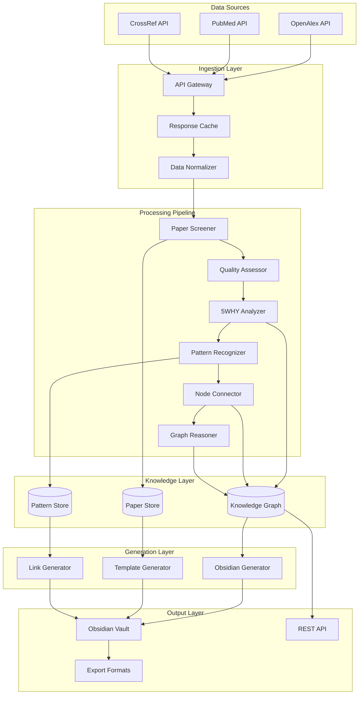

# 🌊 Data Flow Architecture

> **Comprehensive guide to how data moves through the compensation research system**

## 🎯 Overview

The Compensation Research System processes data through a sophisticated pipeline that transforms raw academic literature into structured, actionable clinical knowledge. This document details every step of the data transformation process.

## 📊 High-Level Data Flow



## 📥 Data Ingestion

### **1. Source Data Collection**

#### **OpenAlex API Response**
```json
{
  "results": [
    {
      "id": "https://openalex.org/W1234567890",
      "display_name": "Hip abductor weakness and compensatory strategies",
      "publication_year": 2023,
      "authors": [
        {
          "author": {
            "id": "https://openalex.org/A1234567890",
            "display_name": "Jane Smith",
            "orcid": "https://orcid.org/0000-0000-0000-0000"
          }
        }
      ],
      "primary_location": {
        "source": {
          "id": "https://openalex.org/S1234567890",
          "display_name": "Journal of Biomechanics",
          "type": "journal"
        }
      },
      "abstract_inverted_index": {
        "hip": [0, 15, 42],
        "abductor": [1, 16],
        "weakness": [2, 17, 35],
        "compensation": [8, 23, 41]
      },
      "cited_by_count": 25,
      "concepts": [
        {
          "id": "https://openalex.org/C1234567890",
          "display_name": "Biomechanics",
          "score": 0.8
        }
      ]
    }
  ]
}
```

#### **Data Normalization Process**
```python
class DataNormalizer:
    def normalize_paper_data(self, raw_data: Dict) -> NormalizedPaper:
        """Normalize paper data from various sources"""

        # Extract core metadata
        paper = NormalizedPaper(
            source_id=self._extract_id(raw_data),
            title=self._clean_title(raw_data.get('display_name', '')),
            authors=self._extract_authors(raw_data.get('authors', [])),
            journal=self._extract_journal_info(raw_data.get('primary_location', {})),
            publication_date=self._parse_date(raw_data.get('publication_year')),
            doi=self._extract_doi(raw_data),
            abstract=self._reconstruct_abstract(raw_data.get('abstract_inverted_index', {})),
            keywords=self._extract_keywords(raw_data.get('concepts', [])),
            citations=raw_data.get('cited_by_count', 0),
            open_access=self._check_open_access(raw_data.get('open_access', {}))
        )

        # Add source-specific metadata
        paper.source_metadata = {
            'openalex_id': raw_data.get('id'),
            'work_type': raw_data.get('type'),
            'language': raw_data.get('language'),
            'is_retracted': raw_data.get('is_retracted', False)
        }

        return paper
```

### **2. Quality Preprocessing**

#### **Content Validation**
```python
class ContentValidator:
    def validate_paper_content(self, paper: NormalizedPaper) -> ValidationResult:
        """Validate paper content quality and completeness"""

        issues = []

        # Title validation
        if len(paper.title) < 10:
            issues.append("Title too short")
        if not self._contains_relevant_keywords(paper.title):
            issues.append("Title lacks relevant keywords")

        # Abstract validation
        if not paper.abstract:
            issues.append("Missing abstract")
        elif len(paper.abstract) < 100:
            issues.append("Abstract too short")

        # Author validation
        if not paper.authors:
            issues.append("No authors listed")

        # Journal validation
        if not paper.journal.name:
            issues.append("Missing journal information")

        return ValidationResult(
            is_valid=len(issues) == 0,
            quality_score=self._calculate_quality_score(paper, issues),
            issues=issues
        )
```

## 🔍 Processing Pipeline

### **Stage 1: Paper Screening**

#### **Field Specialization Filter**
```python
def filter_by_field_specialization(self, papers: List[NormalizedPaper]) -> List[FilteredPaper]:
    """Apply field-specific filtering criteria"""

    filtered_papers = []

    for paper in papers:
        scores = FilteringScores()

        # Journal quality assessment
        journal_score = self._assess_journal_quality(paper.journal)
        scores.journal_quality = journal_score

        # Keyword relevance
        title_keywords = self._extract_compensation_keywords(paper.title)
        abstract_keywords = self._extract_compensation_keywords(paper.abstract)
        scores.keyword_relevance = len(title_keywords) * 2 + len(abstract_keywords)

        # Anatomical focus
        anatomical_terms = self._identify_anatomical_terms(paper.title + " " + paper.abstract)
        scores.anatomical_focus = len(anatomical_terms)

        # Exclusion criteria
        exclusion_terms = self._check_exclusion_criteria(paper.title + " " + paper.abstract)
        scores.exclusion_penalty = len(exclusion_terms) * -2

        # Calculate total score
        total_score = (scores.journal_quality + scores.keyword_relevance +
                      scores.anatomical_focus + scores.exclusion_penalty)

        if total_score >= self.field_threshold:
            filtered_paper = FilteredPaper(
                paper=paper,
                filtering_scores=scores,
                total_score=total_score
            )
            filtered_papers.append(filtered_paper)

    return sorted(filtered_papers, key=lambda x: x.total_score, reverse=True)
```

#### **Research Quality Assessment**
```python
def assess_research_quality(self, paper: FilteredPaper) -> QualityAssessment:
    """Comprehensive research quality assessment"""

    assessment = QualityAssessment()

    # Study design scoring
    design_indicators = {
        'randomized controlled trial': 10,
        'systematic review': 9,
        'meta-analysis': 9,
        'cohort study': 7,
        'cross-sectional': 5,
        'case-control': 4,
        'case series': 2,
        'case report': 1
    }

    text = (paper.paper.title + " " + paper.paper.abstract).lower()
    assessment.design_score = max([score for term, score in design_indicators.items()
                                  if term in text] or [0])

    # Sample size estimation
    sample_size = self._estimate_sample_size(text)
    assessment.sample_score = min(sample_size / 20, 5) if sample_size else 0

    # Citation impact (age-adjusted)
    years_since_publication = datetime.now().year - paper.paper.publication_date.year
    citation_rate = paper.paper.citations / max(years_since_publication, 1)
    assessment.citation_score = min(citation_rate, 10)

    # Multi-institutional collaboration
    institution_count = len(set(author.affiliation for author in paper.paper.authors
                               if author.affiliation))
    assessment.collaboration_score = min(institution_count, 3)

    # Calculate composite quality score
    assessment.total_score = (assessment.design_score + assessment.sample_score +
                            assessment.citation_score + assessment.collaboration_score)

    return assessment
```

### **Stage 2: 5WHY Analysis**

#### **Content Extraction**
```python
def extract_causal_content(self, paper: QualityAssessedPaper) -> CausalContent:
    """Extract content relevant to causal analysis"""

    text = paper.paper.title + " " + paper.paper.abstract

    # Identify dysfunction mentions
    dysfunctions = self._identify_dysfunctions(text)

    # Extract compensation indicators
    compensations = self._identify_compensations(text)

    # Find causal language
    causal_phrases = self._extract_causal_phrases(text)

    # Identify anatomical structures
    anatomy = self._extract_anatomical_structures(text)

    # Find assessment methods
    assessments = self._identify_assessment_methods(text)

    # Extract intervention approaches
    interventions = self._identify_interventions(text)

    return CausalContent(
        dysfunctions=dysfunctions,
        compensations=compensations,
        causal_phrases=causal_phrases,
        anatomical_structures=anatomy,
        assessment_methods=assessments,
        interventions=interventions
    )
```

#### **5WHY Level Construction**
```python
def construct_5why_levels(self, content: CausalContent) -> List[WhyLevel]:
    """Construct 5WHY analysis levels from extracted content"""

    levels = []

    # Level 1: Clinical presentation
    level1 = self._construct_level1(content.dysfunctions, content.assessments)
    levels.append(level1)

    # Level 2: Primary dysfunction
    level2 = self._construct_level2(content.dysfunctions, content.anatomical_structures)
    levels.append(level2)

    # Level 3: Functional origin
    level3 = self._construct_level3(content.causal_phrases, content.anatomical_structures)
    levels.append(level3)

    # Level 4: Neuromotor adaptation
    level4 = self._construct_level4(content.compensations, content.causal_phrases)
    levels.append(level4)

    # Level 5: System integration
    level5 = self._construct_level5(content.compensations, content.interventions)
    levels.append(level5)

    return levels

def _construct_level1(self, dysfunctions: List[str], assessments: List[str]) -> WhyLevel:
    """Construct Level 1: Clinical presentation analysis"""

    if dysfunctions:
        primary_dysfunction = dysfunctions[0]
        question = f"Why does {primary_dysfunction} occur during functional activities?"

        # Find supporting evidence
        evidence_phrases = [phrase for phrase in assessments
                          if any(d in phrase.lower() for d in dysfunctions)]
        evidence = "; ".join(evidence_phrases[:3])

        answer = f"Observable {primary_dysfunction} leads to functional limitations"

        return WhyLevel(
            level=1,
            question=question,
            answer=answer,
            evidence=evidence,
            confidence=0.8 if evidence else 0.5,
            anatomical_focus=[primary_dysfunction]
        )
```

### **Stage 3: Pattern Recognition**

#### **Compensation Pattern Detection**
```python
def detect_compensation_patterns(self, why_analysis: FiveWhyAnalysis) -> List[CompensationPattern]:
    """Detect recurring compensation patterns"""

    patterns = []

    # Analyze each WHY level for patterns
    for i, level in enumerate(why_analysis.why_levels[:-1]):
        next_level = why_analysis.why_levels[i + 1]

        pattern = self._analyze_level_transition(level, next_level)
        if pattern:
            patterns.append(pattern)

    # Identify primary pattern
    primary_pattern = self._identify_primary_pattern(patterns, why_analysis)

    return [primary_pattern] + [p for p in patterns if p != primary_pattern]

def _analyze_level_transition(self, current_level: WhyLevel, next_level: WhyLevel) -> CompensationPattern:
    """Analyze transition between WHY levels for patterns"""

    # Extract dysfunction and compensation from levels
    dysfunction = self._extract_dysfunction(current_level)
    compensation = self._extract_compensation(next_level)

    if dysfunction and compensation:
        # Determine pattern type
        pattern_type = self._classify_pattern_type(dysfunction, compensation)

        # Calculate pattern strength
        strength = self._calculate_pattern_strength(current_level, next_level)

        return CompensationPattern(
            name=f"{dysfunction} to {compensation}",
            primary_dysfunction=dysfunction,
            compensatory_strategy=compensation,
            pattern_type=pattern_type,
            strength=strength,
            evidence_level=min(current_level.confidence, next_level.confidence)
        )

    return None
```

### **Stage 4: Node Creation**

#### **Node Generation Process**
```python
def create_nodes_from_analysis(self, analysis: FiveWhyAnalysis) -> List[Node]:
    """Create knowledge graph nodes from 5WHY analysis"""

    nodes = []

    # Create paper node
    paper_node = Node(
        id=f"paper_{analysis.paper_id}",
        type=NodeType.PAPER,
        title=analysis.paper_title,
        attributes={
            'quality_score': analysis.quality_score,
            'publication_year': analysis.publication_year,
            'study_type': analysis.study_type
        }
    )
    nodes.append(paper_node)

    # Create muscle/anatomy nodes
    for level in analysis.why_levels:
        for anatomy in level.anatomical_focus:
            anatomy_node = Node(
                id=f"anatomy_{self._normalize_name(anatomy)}",
                type=self._determine_anatomy_type(anatomy),
                title=anatomy,
                attributes={
                    'mentioned_in_levels': [level.level],
                    'dysfunction_type': level.compensation_type
                }
            )
            nodes.append(anatomy_node)

    # Create pattern nodes
    for pattern in analysis.compensation_patterns:
        pattern_node = Node(
            id=f"pattern_{self._normalize_name(pattern.name)}",
            type=NodeType.PATTERN,
            title=pattern.name,
            attributes={
                'pattern_type': pattern.pattern_type,
                'strength': pattern.strength,
                'primary_dysfunction': pattern.primary_dysfunction,
                'compensatory_strategy': pattern.compensatory_strategy
            }
        )
        nodes.append(pattern_node)

    return nodes
```

### **Stage 5: Graph Construction**

#### **Connection Algorithm**
```python
def build_node_connections(self, all_nodes: List[Node]) -> List[Connection]:
    """Build connections between all nodes in the knowledge graph"""

    connections = []

    for i, source_node in enumerate(all_nodes):
        for target_node in all_nodes[i+1:]:
            connection = self._evaluate_connection(source_node, target_node)
            if connection and connection.strength >= self.connection_threshold:
                connections.append(connection)

    return connections

def _evaluate_connection(self, source: Node, target: Node) -> Optional[Connection]:
    """Evaluate potential connection between two nodes"""

    # Skip connections between same type unless specific cases
    if source.type == target.type and not self._allow_same_type_connection(source, target):
        return None

    # Calculate different types of connection strength
    anatomical_strength = self._calculate_anatomical_connection(source, target)
    functional_strength = self._calculate_functional_connection(source, target)
    causal_strength = self._calculate_causal_connection(source, target)
    evidence_strength = self._calculate_evidence_connection(source, target)

    # Determine primary connection type
    strengths = {
        ConnectionType.ANATOMICAL: anatomical_strength,
        ConnectionType.FUNCTIONAL: functional_strength,
        ConnectionType.CAUSAL: causal_strength,
        ConnectionType.EVIDENCE: evidence_strength
    }

    primary_type = max(strengths, key=strengths.get)
    total_strength = max(strengths.values())

    if total_strength >= self.connection_threshold:
        return Connection(
            source_id=source.id,
            target_id=target.id,
            connection_type=primary_type,
            strength=total_strength,
            metadata={
                'anatomical_score': anatomical_strength,
                'functional_score': functional_strength,
                'causal_score': causal_strength,
                'evidence_score': evidence_strength
            }
        )

    return None
```

## 📤 Output Generation

### **Obsidian File Generation**

#### **Template Processing**
```python
def generate_obsidian_files(self, knowledge_graph: KnowledgeGraph) -> VaultStructure:
    """Generate complete Obsidian vault from knowledge graph"""

    vault = VaultStructure()

    # Generate paper files
    for paper_node in knowledge_graph.get_nodes_by_type(NodeType.PAPER):
        paper_file = self._generate_paper_file(paper_node, knowledge_graph)
        vault.add_file(paper_file)

    # Generate pattern files
    for pattern_node in knowledge_graph.get_nodes_by_type(NodeType.PATTERN):
        pattern_file = self._generate_pattern_file(pattern_node, knowledge_graph)
        vault.add_file(pattern_file)

    # Generate anatomy files
    for anatomy_node in knowledge_graph.get_nodes_by_type(NodeType.MUSCLE):
        anatomy_file = self._generate_anatomy_file(anatomy_node, knowledge_graph)
        vault.add_file(anatomy_file)

    # Generate index files
    index_files = self._generate_index_files(knowledge_graph)
    vault.add_files(index_files)

    # Generate graph visualization files
    graph_files = self._generate_graph_files(knowledge_graph)
    vault.add_files(graph_files)

    return vault

def _generate_paper_file(self, paper_node: Node, graph: KnowledgeGraph) -> ObsidianFile:
    """Generate individual paper analysis file"""

    # Get connected nodes
    connected_nodes = graph.get_connected_nodes(paper_node)

    # Get analysis data
    analysis_data = paper_node.attributes.get('analysis_data', {})

    # Format content using template
    content = self.paper_template.format(
        title=paper_node.title,
        metadata=self._format_metadata(paper_node),
        why_analysis=self._format_why_analysis(analysis_data.get('why_levels', [])),
        compensation_patterns=self._format_patterns(analysis_data.get('patterns', [])),
        connections=self._format_connections(connected_nodes),
        cross_references=self._generate_cross_references(connected_nodes)
    )

    # Determine file location
    file_path = self._determine_file_path(paper_node)

    return ObsidianFile(
        path=file_path,
        content=content,
        metadata={
            'node_id': paper_node.id,
            'generated_at': datetime.now(),
            'connections_count': len(connected_nodes)
        }
    )
```

### **Cross-Reference Generation**

#### **Link Creation Algorithm**
```python
def generate_cross_references(self, node: Node, graph: KnowledgeGraph) -> Dict[str, List[str]]:
    """Generate intelligent cross-references for a node"""

    references = {
        'direct_connections': [],
        'anatomical_relationships': [],
        'functional_relationships': [],
        'causal_relationships': [],
        'evidence_relationships': [],
        'treatment_relationships': []
    }

    # Get all connections for this node
    connections = graph.get_connections(node.id)

    for connection in connections:
        target_node = graph.get_node(connection.target_id)
        link_text = f"[[{target_node.title}]]"

        # Categorize connection
        if connection.strength >= 0.8:
            references['direct_connections'].append(link_text)

        if connection.connection_type == ConnectionType.ANATOMICAL:
            references['anatomical_relationships'].append(link_text)
        elif connection.connection_type == ConnectionType.FUNCTIONAL:
            references['functional_relationships'].append(link_text)
        elif connection.connection_type == ConnectionType.CAUSAL:
            references['causal_relationships'].append(link_text)
        elif connection.connection_type == ConnectionType.EVIDENCE:
            references['evidence_relationships'].append(link_text)

        # Add treatment connections for relevant nodes
        if target_node.type == NodeType.TREATMENT:
            references['treatment_relationships'].append(link_text)

    # Sort and limit references
    for category in references:
        references[category] = sorted(set(references[category]))[:10]

    return references
```

## 📊 Data Quality Metrics

### **Pipeline Quality Tracking**
```python
class DataQualityTracker:
    def track_pipeline_quality(self, pipeline_run: PipelineRun) -> QualityReport:
        """Track quality metrics throughout the pipeline"""

        metrics = {}

        # Input quality
        metrics['input_quality'] = {
            'total_papers_collected': len(pipeline_run.raw_papers),
            'valid_papers_ratio': pipeline_run.validation_pass_rate,
            'api_response_completeness': pipeline_run.api_completeness_score
        }

        # Processing quality
        metrics['processing_quality'] = {
            'screening_precision': pipeline_run.screening_precision,
            'screening_recall': pipeline_run.screening_recall,
            'analysis_completeness': pipeline_run.analysis_completeness,
            'pattern_recognition_accuracy': pipeline_run.pattern_accuracy
        }

        # Output quality
        metrics['output_quality'] = {
            'file_generation_success': pipeline_run.file_generation_success_rate,
            'cross_reference_accuracy': pipeline_run.cross_ref_accuracy,
            'graph_connectivity': pipeline_run.graph_connectivity_score
        }

        return QualityReport(
            timestamp=datetime.now(),
            pipeline_id=pipeline_run.id,
            overall_quality=self._calculate_overall_quality(metrics),
            detailed_metrics=metrics
        )
```

---

**🌊 Data flows through this sophisticated pipeline to ensure that every piece of academic knowledge is transformed into actionable clinical insights with maximum accuracy and relevance.**