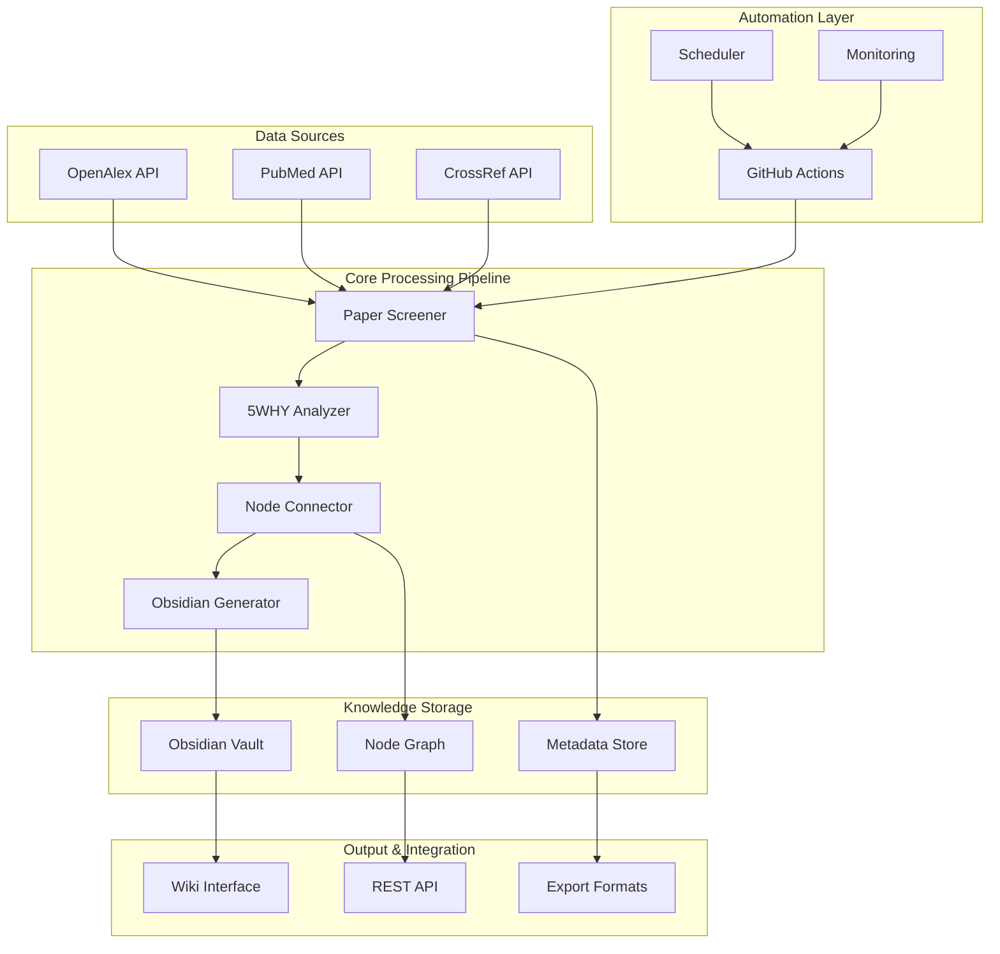

# 🏗️ System Architecture Overview

> **High-level architecture of the 5WHY-based compensation research automation system**

## 🎯 System Purpose

The Compensation Research System is an **autonomous knowledge discovery engine** that:
- **Continuously monitors** academic literature for compensation-related research
- **Applies 5WHY methodology** to extract causal relationships
- **Builds knowledge graphs** connecting compensation mechanisms
- **Generates structured wikis** for clinical and research use

## 📊 Architecture Diagram



## 🔄 Data Flow Architecture

### **1. Input Layer**
```
Academic APIs → Paper Screening → Quality Filtering → Structured Data
     ↓              ↓                 ↓                    ↓
OpenAlex API    Field Filtering   Impact Factor      Paper Metadata
PubMed API      Topic Filtering   Citation Count     Abstract Processing
CrossRef API    Date Filtering    Journal Quality    Author Information
```

### **2. Processing Layer**
```
Raw Papers → 5WHY Analysis → Pattern Recognition → Knowledge Extraction
     ↓            ↓              ↓                      ↓
Text Mining   Causal Chain    Compensation Types    Clinical Insights
NLP Analysis  Root Causes     Mechanism Patterns    Treatment Protocols
Content Parse Evidence Links  Anatomical Relations  Assessment Methods
```

### **3. Knowledge Layer**
```
Structured Data → Node Creation → Graph Building → Relationship Mapping
      ↓               ↓              ↓                    ↓
Paper Nodes      Muscle Nodes    Anatomical Links    Causal Connections
Pattern Nodes    Joint Nodes     Functional Links    Temporal Sequences
Concept Nodes    Treatment Nodes Therapeutic Links   Evidence Strength
```

### **4. Output Layer**
```
Knowledge Graph → Wiki Generation → User Interface → Export Formats
       ↓               ↓                ↓                ↓
Connected Nodes   Markdown Files    Obsidian Vault    JSON Export
Relationship Web  Structured Pages  Graph Navigation  CSV Reports
Semantic Links    Cross References  Search Interface  API Endpoints
```

## 🧩 Component Architecture

### **Core Components**

#### **Paper Screener** (`paper_screener.py`)
- **Purpose**: Intelligent filtering of academic papers
- **Input**: Raw API responses from academic databases
- **Processing**: 3-tier filtering (field → quality → relevance)
- **Output**: High-quality compensation-related papers
- **Technology**: Python, Requests, NLP preprocessing

#### **5WHY Analyzer** (`why_analyzer.py`)
- **Purpose**: Extract causal relationships using 5WHY methodology
- **Input**: Filtered academic papers
- **Processing**: Progressive causal analysis through 5 levels
- **Output**: Structured causal chains and compensation patterns
- **Technology**: Python, NLP, Pattern Recognition

#### **Node Connector** (`node_connector.py`)
- **Purpose**: Build knowledge graph connections
- **Input**: Analyzed papers and extracted patterns
- **Processing**: Multi-type relationship detection and scoring
- **Output**: Weighted relationship network
- **Technology**: Graph algorithms, Similarity metrics

#### **Obsidian Generator** (`obsidian_generator.py`)
- **Purpose**: Create structured wiki documentation
- **Input**: Connected knowledge graph
- **Processing**: Template-based content generation
- **Output**: Complete Obsidian vault with cross-links
- **Technology**: Markdown generation, File system operations

### **Infrastructure Components**

#### **Automation Engine** (GitHub Actions)
```yaml
Trigger Systems:
  - Scheduled: Every 10 minutes
  - Manual: Workflow dispatch
  - Event-driven: Push/PR triggers

Execution Environment:
  - OS: Ubuntu Latest
  - Python: 3.11
  - Resources: 2 CPU cores, 7GB RAM
  - Timeout: 6 hours per run
```

#### **Monitoring & Alerting**
```yaml
Health Checks:
  - System resources (CPU, Memory, Disk)
  - API connectivity (OpenAlex, GitHub)
  - Component status (Import success, Processing errors)
  - Output quality (Papers processed, Patterns found)

Alert Channels:
  - Slack notifications
  - Discord webhooks
  - Email reports
  - GitHub issues (on failure)
```

#### **Data Persistence**
```yaml
Storage Types:
  - Git Repository: Code and configuration
  - Obsidian Vault: Generated knowledge base
  - Artifacts: Compressed vault backups
  - Logs: System operation history

Backup Strategy:
  - Real-time: Git commits after each cycle
  - Daily: Compressed vault archives
  - Weekly: Full system backup
  - Cloud: Optional S3/Azure storage
```

## ⚡ Performance Architecture

### **Scalability Design**
- **Horizontal**: Multiple GitHub Action runners (parallel processing)
- **Vertical**: Optimized algorithms and caching strategies
- **Queue Management**: Built-in rate limiting and retry logic
- **Resource Efficiency**: Memory-optimized processing pipeline

### **Caching Strategy**
```
Multi-Level Cache:
Level 1: Memory Cache (Runtime data)
Level 2: Redis Cache (Session data)
Level 3: Disk Cache (Persistent data)
Level 4: Git LFS (Large file storage)
```

### **Error Handling**
```python
Error Recovery Chain:
1. Automatic Retry (3 attempts with exponential backoff)
2. Graceful Degradation (Skip problematic papers)
3. Partial Processing (Save successful results)
4. Alert Generation (Notify on persistent failures)
5. System Recovery (Health check and restart)
```

## 🔒 Security Architecture

### **Access Control**
- **GitHub Actions**: Token-based authentication
- **API Keys**: Encrypted secrets management
- **Vault Access**: Repository-level permissions
- **Monitoring**: Read-only external access

### **Data Protection**
- **Encryption**: All secrets encrypted at rest
- **Transport**: HTTPS for all API communications
- **Audit Trail**: Complete operation logging
- **Compliance**: Academic fair use guidelines

## 🌐 Integration Architecture

### **External APIs**
```yaml
OpenAlex API:
  - Rate Limit: Unlimited (with courtesy)
  - Authentication: None required
  - Data Format: JSON
  - Reliability: 99.9% uptime

GitHub API:
  - Rate Limit: 5000 requests/hour
  - Authentication: Personal Access Token
  - Data Format: JSON
  - Features: Repository management, Actions
```

### **Output Formats**
```yaml
Primary:
  - Obsidian Vault: Complete wiki with cross-links
  - JSON Export: Structured data for integrations
  - Markdown Files: Individual analysis documents

Secondary:
  - CSV Reports: Tabular data export
  - Graph Data: Network visualization formats
  - API Endpoints: Real-time data access
```

## 📈 Scalability Considerations

### **Current Capacity**
- **Papers/Cycle**: 3-5 papers every 10 minutes
- **Daily Processing**: ~720-1200 papers analyzed
- **Vault Growth**: ~50-100 new files per day
- **Storage Requirements**: ~10MB per 1000 papers

### **Growth Strategy**
- **Phase 1**: Single repository, GitHub Actions
- **Phase 2**: Multi-repository federation
- **Phase 3**: Dedicated server infrastructure
- **Phase 4**: Distributed processing network

---

**🎯 Key Design Principles:**
1. **Autonomy**: Minimal human intervention required
2. **Quality**: Rigorous filtering and validation at every step
3. **Extensibility**: Modular design for easy enhancement
4. **Reliability**: Robust error handling and recovery
5. **Transparency**: Complete audit trail and logging