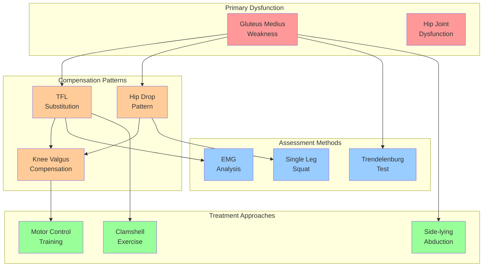
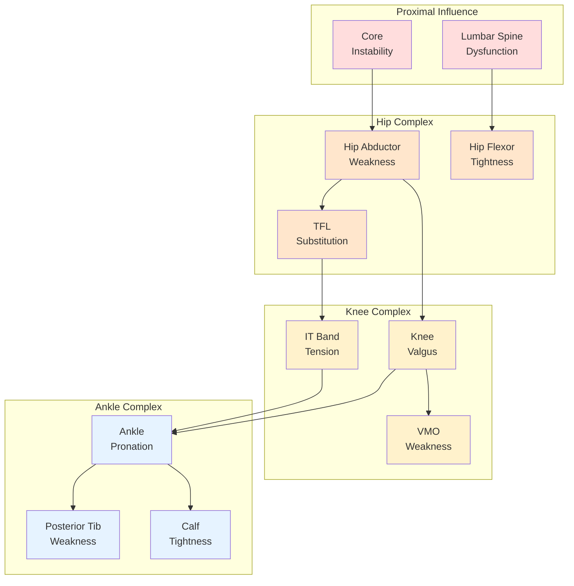
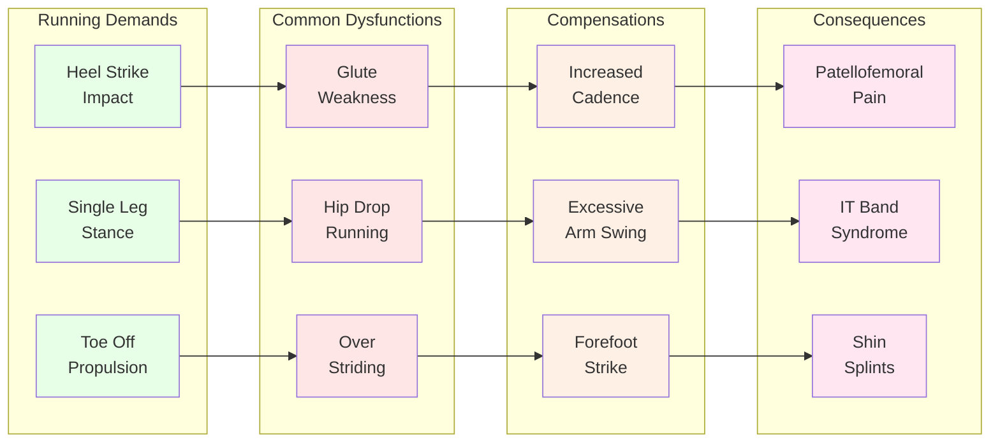
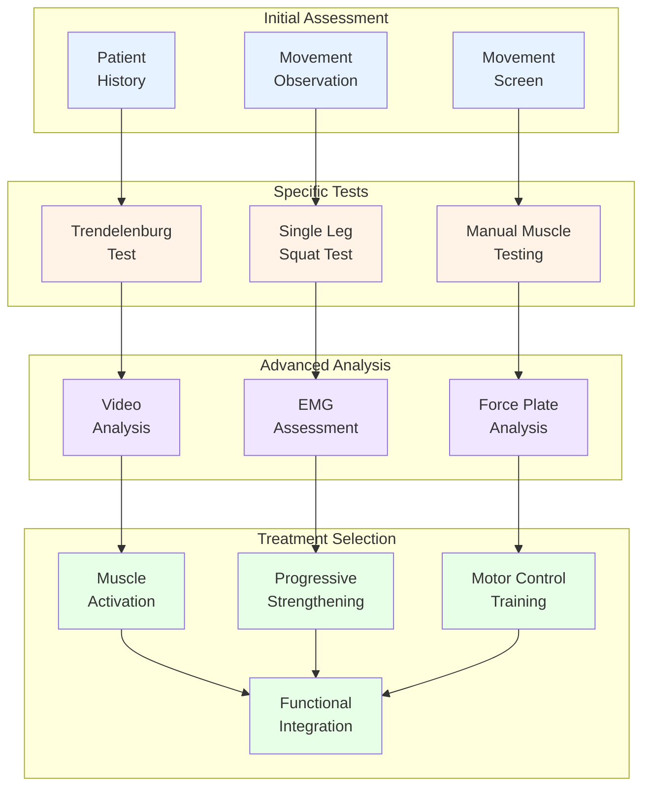

# 🕸️ Network Visualization Examples

> **Interactive knowledge graph demonstrations showing compensation pattern relationships**

## 🎯 Visualization Overview

This document demonstrates how compensation research concepts are connected in our knowledge graph, showing the relationships between muscles, joints, patterns, assessments, and treatments through network visualizations.

## 🧠 Hip Compensation Network

### **Core Network Structure**



### **Connection Strength Indicators**
```yaml
Strong Connections (0.70-1.00):
  - Gluteus Medius ↔ TFL Substitution: 0.85
  - Hip Drop ↔ Trendelenburg Test: 0.82
  - TFL Overactivity ↔ Clamshell Exercise: 0.78

Moderate Connections (0.50-0.69):
  - Gluteus Medius ↔ Knee Valgus: 0.62
  - TFL Substitution ↔ IT Band Tension: 0.58
  - Hip Drop ↔ Single Leg Squat: 0.65

Weak Connections (0.30-0.49):
  - Hip Weakness ↔ Ankle Pronation: 0.38
  - Core Instability ↔ Hip Compensation: 0.42
```

## 🦵 Lower Extremity Compensation Chain

### **Kinetic Chain Visualization**



### **Clinical Interpretation**
```yaml
Compensation Cascade Analysis:
  Level 1 (Primary): Hip abductor weakness
  Level 2 (Regional): TFL substitution, hip drop
  Level 3 (Distant): Knee valgus, IT band tension
  Level 4 (Systemic): Ankle pronation, foot dysfunction

Treatment Priority:
  1. Address primary dysfunction (hip weakness)
  2. Retrain regional compensation (TFL overactivity)
  3. Restore kinetic chain function (knee alignment)
  4. Optimize distal adaptations (ankle mobility)
```

## 🏃‍♀️ Running-Specific Compensation Network

### **Sport-Specific Patterns**



## 🔬 Assessment-Treatment Network

### **Clinical Decision Network**



### **Evidence-Based Pathways**
```yaml
High Evidence Pathways (Level A):
  Assessment → Treatment:
    - Trendelenburg Test → Hip Abductor Strengthening
    - EMG Findings → Motor Control Training
    - Force Analysis → Progressive Loading

Moderate Evidence Pathways (Level B):
    - Movement Screen → Movement Retraining
    - Strength Testing → Functional Progression
    - Pain Assessment → Activity Modification

Emerging Evidence (Level C):
    - Video Analysis → Real-time Feedback
    - Wearable Data → Exercise Prescription
    - Patient Education → Self-Management
```

## 🧮 Network Analytics

### **Node Centrality Analysis**

#### **Most Connected Nodes (Degree Centrality)**
```yaml
Top 10 Hub Nodes:
  1. Gluteus Medius (23 connections)
     - Connected to: weakness patterns, tests, exercises
     - Clinical importance: Central to hip stability

  2. Hip Stability (19 connections)
     - Connected to: assessment tools, training methods
     - Clinical importance: Functional outcome measure

  3. TFL Overactivity (17 connections)
     - Connected to: compensation patterns, treatments
     - Clinical importance: Common substitution strategy

  4. Single Leg Squat (15 connections)
     - Connected to: multiple dysfunction patterns
     - Clinical importance: Functional assessment tool

  5. Motor Control (14 connections)
     - Connected to: treatment approaches, outcomes
     - Clinical importance: Key intervention strategy
```

#### **Pathway Importance (Betweenness Centrality)**
```yaml
Critical Pathway Nodes:
  1. Movement Screen (0.45 betweenness)
     - Bridges initial assessment to specific testing
     - Critical for clinical decision-making

  2. Core Stability (0.38 betweenness)
     - Links spinal function to hip mechanics
     - Important for comprehensive treatment

  3. Functional Integration (0.35 betweenness)
     - Connects isolated exercises to real activities
     - Essential for treatment success

  4. Pain Assessment (0.32 betweenness)
     - Links symptoms to movement dysfunction
     - Guides treatment prioritization
```

### **Cluster Analysis**

#### **Compensation Pattern Clusters**
```yaml
Cluster 1: Hip Abductor Dysfunction (Modularity: 0.85)
  Nodes: Gluteus medius, gluteus minimus, TFL, hip drop
  Clinical Theme: Lateral hip stability deficits
  Treatment Focus: Abductor strengthening, motor control

Cluster 2: Kinetic Chain Dysfunction (Modularity: 0.78)
  Nodes: Hip, knee, ankle interactions
  Clinical Theme: Multi-joint compensation patterns
  Treatment Focus: Chain-based rehabilitation

Cluster 3: Assessment Tools (Modularity: 0.72)
  Nodes: Clinical tests, movement screens, technology
  Clinical Theme: Evaluation methodology
  Treatment Focus: Diagnostic accuracy

Cluster 4: Exercise Interventions (Modularity: 0.80)
  Nodes: Strengthening, motor control, functional training
  Clinical Theme: Treatment approaches
  Treatment Focus: Progressive rehabilitation
```

## 📊 Interactive Network Features

### **Filtering Capabilities**
```yaml
Filter by Node Type:
  - Show only: Muscles, Joints, Patterns, Assessments, Treatments
  - Hide specific categories for focused view
  - Combine filters for custom analysis

Filter by Connection Strength:
  - Strong connections only (>0.70)
  - Moderate and strong (>0.50)
  - All connections (>0.15)

Filter by Evidence Level:
  - Level A evidence only
  - Level B and above
  - All evidence levels

Filter by Clinical Domain:
  - Orthopedic conditions
  - Sports medicine applications
  - Neurological conditions
  - Pediatric populations
```

### **Dynamic Visualization Controls**
```yaml
Layout Options:
  - Force-directed layout (default)
  - Hierarchical layout (levels)
  - Circular layout (relationships)
  - Custom positioning

Node Sizing:
  - By connection count (degree centrality)
  - By clinical importance
  - By evidence strength
  - Uniform sizing

Edge Styling:
  - Thickness by connection strength
  - Color by connection type
  - Style by evidence level
  - Animation for pathways
```

## 🎯 Clinical Applications

### **Differential Diagnosis Support**
```python
# Example: Patient presents with hip drop during walking
def find_related_patterns(symptom="hip_drop"):
    related_nodes = network.get_connected_nodes(symptom)

    likely_causes = [
        "gluteus_medius_weakness",
        "hip_joint_dysfunction",
        "core_instability"
    ]

    recommended_tests = [
        "trendelenburg_test",
        "single_leg_squat",
        "hip_abductor_strength"
    ]

    return likely_causes, recommended_tests
```

### **Treatment Planning Pathways**
```python
# Example: Plan treatment for identified gluteus medius weakness
def generate_treatment_pathway(diagnosis="gluteus_medius_weakness"):
    pathway = network.shortest_path(
        start=diagnosis,
        end="functional_restoration"
    )

    treatment_sequence = [
        "muscle_activation_exercises",
        "progressive_strengthening",
        "motor_control_training",
        "functional_integration"
    ]

    return pathway, treatment_sequence
```

### **Research Gap Identification**
```python
# Example: Identify underexplored connections
def find_research_gaps():
    weak_connections = network.get_connections(strength_range=(0.30, 0.50))
    high_clinical_importance = network.get_nodes(clinical_score=">7.0")

    research_opportunities = []
    for connection in weak_connections:
        if connection.involves_high_importance_nodes():
            research_opportunities.append(connection)

    return research_opportunities
```

## 🔗 Integration Examples

### **With Paper Analysis**
- Nodes created from 5WHY analysis results
- Connections weighted by evidence strength
- Dynamic updates as new papers are analyzed

### **With Clinical Tools**
- Assessment tool recommendations based on network pathways
- Treatment protocol generation from evidence-based connections
- Outcome prediction using network analysis

### **With Educational Content**
- Visual learning aids for complex compensation patterns
- Interactive case studies with network exploration
- Professional development modules with pathway analysis

---

**🕸️ These network visualizations reveal the complex relationships in compensation research, supporting clinical decision-making through evidence-based pattern recognition and treatment pathway optimization.**