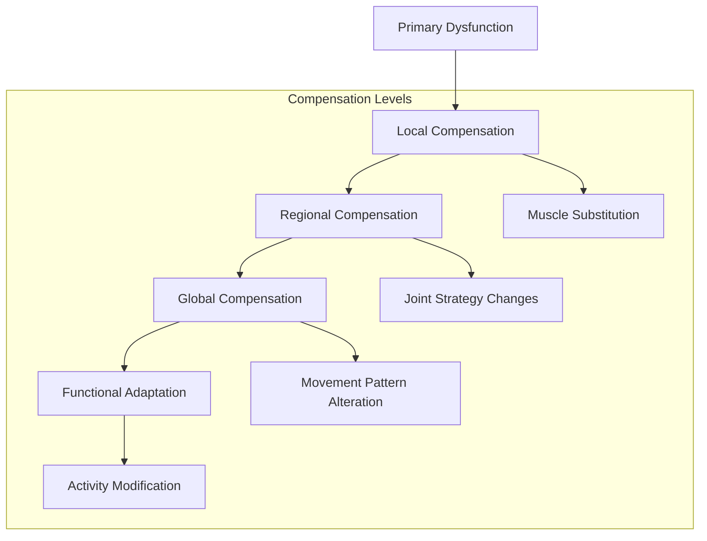

# 🧠 Compensation Theory

> **Understanding the biomechanical and neurological foundations of human movement compensation patterns**

## 🎯 Overview

Compensation theory in human movement represents the body's adaptive response to dysfunction, weakness, or pathology. This document provides the theoretical framework that guides our 5WHY analysis methodology for compensation research.

## 🔬 Core Principles

### **1. Hierarchical Compensation Model**

### **2. Neuromotor Control Framework**

**Central Nervous System Adaptations:**
- **Motor Planning Modifications**: CNS alters movement strategies to bypass dysfunction
- **Sensorimotor Integration**: Compensation of proprioceptive deficits
- **Motor Learning**: Reinforcement of compensatory patterns through repetition

**Peripheral Adaptations:**
- **Muscle Activation Changes**: Altered timing and magnitude of muscle contractions
- **Joint Mechanics**: Modified arthrokinematics and osteokinematics
- **Tissue Adaptations**: Structural changes in response to altered loading

## 🏃‍♂️ Classification of Compensation Patterns

### **Type 1: Substitution Compensation**
**Definition**: Alternative muscles or muscle groups take over the function of weakened/inhibited muscles.

**Clinical Examples:**
- **TFL substitution for gluteus medius**: Hip abduction weakness leading to tensor fasciae latae overactivity
- **Upper trapezius for lower trapezius**: Scapular elevation compensating for depression weakness
- **Gastrocnemius for soleus**: Ankle plantarflexion compensation in posterior tibialis dysfunction

**5WHY Analysis Pattern:**
1. **WHY**: Why does the patient show abnormal movement?
2. **WHY**: Why is the primary muscle not functioning?
3. **WHY**: Why did the substitution pattern develop?
4. **WHY**: Why does the substitution persist?
5. **WHY**: Why is the compensation becoming problematic?

### **Type 2: Avoidance Compensation**
**Definition**: Movement strategies that avoid using painful or dysfunctional body segments.

**Clinical Examples:**
- **Lateral trunk lean**: Avoiding hip abductor activation in hip pain
- **Knee valgus avoidance**: Modified landing patterns in ACL deficiency
- **Thoracic rotation reduction**: Compensating for cervical dysfunction

### **Type 3: Mechanical Compensation**
**Definition**: Biomechanical adaptations to maintain function despite structural limitations.

**Clinical Examples:**
- **Increased lumbar lordosis**: Compensating for hip flexion restriction
- **Anterior pelvic tilt**: Hip flexor tightness compensation
- **Scapular winging**: Serratus anterior weakness adaptation

## 🧬 Physiological Mechanisms

### **Neuroplasticity and Compensation**

**Cortical Reorganization:**
- Motor cortex map changes following injury
- Recruitment of alternative neural pathways
- Cross-education effects between limbs

**Spinal Level Adaptations:**
- Alpha motor neuron pool modifications
- Interneuron circuit reorganization
- Reciprocal inhibition pattern changes

### **Musculoskeletal Adaptations**

**Muscle Architecture Changes:**
- Fiber type shifting in compensating muscles
- Pennation angle modifications
- Fascicle length adaptations

**Connective Tissue Adaptations:**
- Fascial tension pattern changes
- Joint capsule modifications
- Ligament stress adaptations

## 🔍 Assessment Framework

### **Movement Screen Hierarchy**

1. **Global Movement Patterns**
   - Overhead squat assessment
   - Single-leg squat evaluation
   - Gait analysis

2. **Regional Movement Assessment**
   - Joint-specific range of motion
   - Muscle activation timing
   - Force production capacity

3. **Local Tissue Assessment**
   - Muscle length testing
   - Joint mobility assessment
   - Tissue quality evaluation

### **Compensation Identification Criteria**

**Primary Indicators:**
- ✅ **Abnormal movement timing**: Premature or delayed muscle activation
- ✅ **Altered force vectors**: Direction changes in force application
- ✅ **Range of motion modifications**: Compensatory mobility changes
- ✅ **Pain avoidance patterns**: Movement strategies to reduce symptoms

**Secondary Indicators:**
- 🔄 **Fatigue-related changes**: Movement degradation with repetition
- 🔄 **Load-dependent modifications**: Pattern changes with resistance
- 🔄 **Speed-dependent alterations**: Compensation emergence with velocity changes

## 🎯 Clinical Application

### **Treatment Hierarchy**

**Phase 1: Address Root Cause**
- Restore primary muscle function
- Eliminate pain generators
- Improve mobility restrictions

**Phase 2: Retrain Movement Patterns**
- Motor control exercises
- Functional movement training
- Gradual loading progression

**Phase 3: Integrate Function**
- Sport/activity-specific training
- High-level movement challenges
- Performance optimization

### **Outcome Prediction Framework**

**Favorable Prognosis Indicators:**
- 🟢 **Recent onset compensation** (<3 months)
- 🟢 **Minimal structural changes**
- 🟢 **Good motor learning capacity**
- 🟢 **High motivation for change**

**Challenging Prognosis Indicators:**
- 🔴 **Chronic compensation patterns** (>12 months)
- 🔴 **Structural adaptations present**
- 🔴 **Multiple compensation layers**
- 🔴 **Central sensitization involvement**

## 📊 Research Integration

### **Evidence Hierarchy for Compensation Studies**

**Level A Evidence:**
- Randomized controlled trials with kinematic/kinetic analysis
- Systematic reviews of compensation interventions
- Meta-analyses of movement pattern studies

**Level B Evidence:**
- Cohort studies with EMG analysis
- Case-control studies with 3D motion analysis
- Cross-sectional studies with validated assessment tools

**Level C Evidence:**
- Case series with detailed movement analysis
- Expert consensus statements
- Theoretical models with preliminary validation

### **5WHY Integration Points**

Each WHY level should address specific theoretical components:

**WHY 1**: Observable compensation pattern (phenomenology)
**WHY 2**: Immediate biomechanical cause (mechanism)
**WHY 3**: Underlying dysfunction or pathology (etiology)
**WHY 4**: Predisposing factors or triggers (risk factors)
**WHY 5**: Systemic or environmental influences (context)

## 🔗 Related Concepts

- **[5WHY Analysis Framework](5why-framework.md)** - Practical application methodology
- **[Node Connection Logic](node-connections.md)** - Knowledge graph relationships
- **[Paper Quality Standards](quality-standards.md)** - Research evaluation criteria

---

**🧠 This theoretical framework guides our evidence-based approach to understanding and analyzing human movement compensation patterns in physical therapy and biomechanics research.**