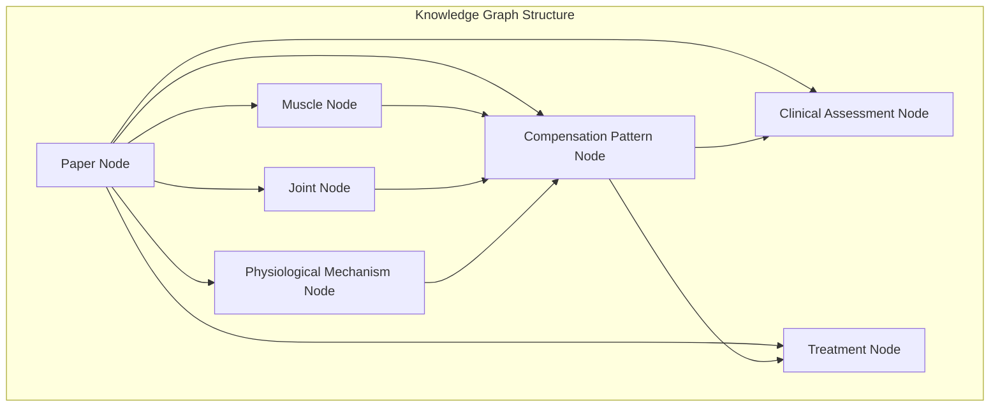

# 🕸️ Node Connection Logic

> **Knowledge graph construction methodology for compensation research concepts**

## 🎯 Overview

This document explains how our system creates intelligent connections between compensation research concepts, building a comprehensive knowledge graph that reveals relationships between muscles, joints, patterns, assessments, and treatments.

## 🧩 Node Types & Categories

### **Primary Node Types**



**Node Categories:**

1. **Paper Nodes** (`PAPER`)
   - Research papers and studies
   - Systematic reviews and meta-analyses
   - Clinical guidelines

2. **Anatomical Nodes** (`MUSCLE`, `JOINT`, `STRUCTURE`)
   - Individual muscles (Gluteus medius, TFL, etc.)
   - Joint complexes (Hip, Knee, Ankle, etc.)
   - Anatomical structures (Fascia, ligaments, etc.)

3. **Compensation Pattern Nodes** (`PATTERN`)
   - Specific compensation mechanisms
   - Movement dysfunction patterns
   - Substitution strategies

4. **Assessment Nodes** (`ASSESSMENT`)
   - Clinical tests and measures
   - Movement screens
   - Diagnostic procedures

5. **Intervention Nodes** (`TREATMENT`)
   - Exercise protocols
   - Manual therapy techniques
   - Movement retraining strategies

6. **Mechanism Nodes** (`MECHANISM`)
   - Physiological processes
   - Neurological adaptations
   - Biomechanical principles

## 🔗 Connection Types & Algorithms

### **Connection Categories**

```yaml
Connection Types:
  ANATOMICAL: Physical/structural relationships
  FUNCTIONAL: Movement/performance relationships
  CAUSAL: Cause-and-effect relationships
  THERAPEUTIC: Treatment-related relationships
  TEMPORAL: Time-sequence relationships
  EVIDENCE: Research support relationships
  CLINICAL: Assessment-finding relationships
```

### **1. Anatomical Connections**

**Algorithm: Anatomical Proximity Scoring**
```python
def calculate_anatomical_proximity(node1, node2):
    """Calculate anatomical connection strength (0.0-0.3)"""

    # Direct anatomical relationships
    direct_connections = {
        "gluteus_medius": ["hip_joint", "ilium", "greater_trochanter"],
        "tensor_fasciae_latae": ["iliac_crest", "IT_band", "tibia"],
        "quadratus_lumborum": ["12th_rib", "lumbar_vertebrae", "iliac_crest"]
    }

    # Fascial chain connections
    fascial_chains = {
        "lateral_chain": ["gluteus_medius", "TFL", "IT_band", "vastus_lateralis"],
        "posterior_chain": ["gluteus_maximus", "hamstrings", "gastrocnemius"],
        "anterior_chain": ["hip_flexors", "quadriceps", "anterior_tibialis"]
    }

    # Kinetic chain relationships
    kinetic_chains = {
        "lower_extremity": ["hip", "knee", "ankle"],
        "spine": ["cervical", "thoracic", "lumbar", "sacroiliac"],
        "shoulder_girdle": ["scapula", "glenohumeral", "sternoclavicular"]
    }

    proximity_score = 0.0

    # Direct connection (0.25-0.30)
    if is_directly_connected(node1, node2, direct_connections):
        proximity_score = 0.30

    # Fascial chain connection (0.15-0.20)
    elif shares_fascial_chain(node1, node2, fascial_chains):
        proximity_score = 0.20

    # Kinetic chain connection (0.10-0.15)
    elif shares_kinetic_chain(node1, node2, kinetic_chains):
        proximity_score = 0.15

    # Regional proximity (0.05-0.10)
    elif same_body_region(node1, node2):
        proximity_score = 0.10

    return proximity_score
```

**Clinical Examples:**
```yaml
High Anatomical Connection (0.25-0.30):
  - Gluteus Medius ↔ Hip Joint
  - TFL ↔ IT Band
  - Quadratus Lumborum ↔ Lumbar Spine

Medium Anatomical Connection (0.15-0.20):
  - Gluteus Medius ↔ TFL (lateral chain)
  - Hip Flexors ↔ Quadriceps (anterior chain)
  - Hamstrings ↔ Gastrocnemius (posterior chain)

Lower Anatomical Connection (0.10-0.15):
  - Hip ↔ Knee (kinetic chain)
  - Scapula ↔ Glenohumeral Joint
  - Cervical ↔ Thoracic Spine
```

### **2. Functional Connections**

**Algorithm: Movement Function Scoring**
```python
def calculate_functional_similarity(node1, node2):
    """Calculate functional connection strength (0.0-0.3)"""

    # Primary movement functions
    movement_functions = {
        "hip_abduction": ["gluteus_medius", "gluteus_minimus", "TFL"],
        "hip_stabilization": ["gluteus_medius", "deep_hip_rotators", "quadratus_lumborum"],
        "knee_stabilization": ["vastus_medialis", "gluteus_medius", "hip_external_rotators"],
        "ankle_stabilization": ["peroneus_longus", "posterior_tibialis", "gastrocnemius"]
    }

    # Compensation relationships
    compensation_patterns = {
        "gluteus_medius_weakness": {
            "primary_compensators": ["TFL", "quadratus_lumborum", "adductors"],
            "secondary_effects": ["knee_valgus", "ankle_pronation", "lumbar_rotation"]
        },
        "deep_neck_flexor_weakness": {
            "primary_compensators": ["SCM", "anterior_scalenes", "upper_trapezius"],
            "secondary_effects": ["forward_head_posture", "shoulder_elevation"]
        }
    }

    functional_score = 0.0

    # Primary function sharing (0.25-0.30)
    if shares_primary_function(node1, node2, movement_functions):
        functional_score = 0.30

    # Compensation relationship (0.20-0.25)
    elif has_compensation_relationship(node1, node2, compensation_patterns):
        functional_score = 0.25

    # Synergistic function (0.15-0.20)
    elif has_synergistic_function(node1, node2):
        functional_score = 0.20

    # Movement system relationship (0.10-0.15)
    elif shares_movement_system(node1, node2):
        functional_score = 0.15

    return functional_score
```

### **3. Causal Connections**

**Algorithm: 5WHY-Based Causality**
```python
def calculate_causal_relationship(source_node, target_node):
    """Calculate causal connection strength (0.0-0.4)"""

    # Direct causal relationships from 5WHY analysis
    causal_chains = extract_causal_chains_from_papers()

    # Strength based on evidence and consistency
    causal_strength = 0.0

    # Strong causal evidence (0.30-0.40)
    if has_strong_causal_evidence(source_node, target_node):
        # Multiple high-quality papers showing clear causation
        # Experimental evidence of cause-effect
        # Consistent findings across studies
        causal_strength = 0.40

    # Moderate causal evidence (0.20-0.30)
    elif has_moderate_causal_evidence(source_node, target_node):
        # Some papers showing causal relationship
        # Observational evidence
        # Logical biomechanical reasoning
        causal_strength = 0.25

    # Weak causal evidence (0.10-0.20)
    elif has_weak_causal_evidence(source_node, target_node):
        # Theoretical relationship
        # Limited evidence
        # Expert consensus
        causal_strength = 0.15

    return causal_strength
```

**Causal Chain Examples:**
```yaml
Strong Causal Relationships (0.30-0.40):
  - Gluteus Medius Weakness → Hip Drop Pattern
  - TFL Overactivity → IT Band Tension
  - Forward Head Posture → Upper Cervical Extension

Moderate Causal Relationships (0.20-0.30):
  - Hip Abductor Weakness → Knee Valgus
  - Core Weakness → Low Back Pain
  - Ankle Instability → Hip Compensation

Weak Causal Relationships (0.10-0.20):
  - Foot Dysfunction → Neck Pain
  - Breathing Pattern → Shoulder Position
  - Jaw Tension → Cervical Dysfunction
```

### **4. Therapeutic Connections**

**Algorithm: Treatment Relationship Scoring**
```python
def calculate_therapeutic_relationship(assessment_node, treatment_node):
    """Calculate therapeutic connection strength (0.0-0.3)"""

    # Evidence-based treatment protocols
    treatment_protocols = {
        "gluteus_medius_weakness": {
            "primary_treatments": ["clamshells", "side_lying_abduction", "single_leg_squats"],
            "secondary_treatments": ["hip_bridges", "monster_walks", "step_ups"],
            "assessments": ["trendelenburg_test", "single_leg_squat_test"]
        }
    }

    therapeutic_score = 0.0

    # Direct treatment protocol (0.25-0.30)
    if is_evidence_based_treatment(assessment_node, treatment_node):
        therapeutic_score = 0.30

    # Supportive treatment (0.15-0.20)
    elif is_supportive_treatment(assessment_node, treatment_node):
        therapeutic_score = 0.20

    # General treatment category (0.10-0.15)
    elif shares_treatment_category(assessment_node, treatment_node):
        therapeutic_score = 0.15

    return therapeutic_score
```

## 🔢 Connection Strength Calculation

### **Master Algorithm**
```python
def calculate_connection_strength(source_node, target_node):
    """Calculate overall connection strength (0.0-1.0)"""

    # Weight distribution
    weights = {
        "anatomical": 0.25,      # 25% of total score
        "functional": 0.30,      # 30% of total score
        "causal": 0.30,          # 30% of total score
        "therapeutic": 0.15      # 15% of total score
    }

    # Calculate individual scores
    anatomical_score = calculate_anatomical_proximity(source_node, target_node)
    functional_score = calculate_functional_similarity(source_node, target_node)
    causal_score = calculate_causal_relationship(source_node, target_node)
    therapeutic_score = calculate_therapeutic_relationship(source_node, target_node)

    # Evidence support multiplier
    evidence_multiplier = calculate_evidence_support(source_node, target_node)

    # Clinical co-occurrence boost
    cooccurrence_boost = calculate_clinical_cooccurrence(source_node, target_node)

    # Weighted total
    total_strength = (
        anatomical_score * weights["anatomical"] +
        functional_score * weights["functional"] +
        causal_score * weights["causal"] +
        therapeutic_score * weights["therapeutic"]
    )

    # Apply modifiers
    total_strength *= evidence_multiplier
    total_strength += cooccurrence_boost

    # Ensure bounds
    return min(total_strength, 1.0)
```

### **Connection Thresholds**
```yaml
Connection Strength Categories:
  Strong (0.70-1.00): Primary relationships, direct clinical relevance
  Moderate (0.50-0.69): Secondary relationships, indirect relevance
  Weak (0.30-0.49): Tertiary relationships, potential relevance
  Minimal (0.15-0.29): Distant relationships, research interest only
  None (<0.15): No meaningful connection, exclude from graph
```

## 🧠 Pattern Recognition Algorithms

### **Compensation Pattern Detection**
```python
def detect_compensation_patterns(paper_analysis):
    """Identify compensation patterns from 5WHY analysis"""

    patterns = []

    # Extract muscle mentions and relationships
    muscles = extract_muscles_from_analysis(paper_analysis)
    dysfunctions = extract_dysfunctions_from_analysis(paper_analysis)
    compensations = extract_compensations_from_analysis(paper_analysis)

    # Pattern matching algorithms
    for dysfunction in dysfunctions:
        for compensation in compensations:
            if is_known_pattern(dysfunction, compensation):
                pattern = create_pattern_node(dysfunction, compensation)
                patterns.append(pattern)

    return patterns
```

### **Treatment Protocol Extraction**
```python
def extract_treatment_protocols(paper_analysis):
    """Extract treatment approaches from paper analysis"""

    protocols = []

    # Identify treatment mentions
    treatments = extract_treatments_from_analysis(paper_analysis)
    outcomes = extract_outcomes_from_analysis(paper_analysis)

    # Link treatments to outcomes
    for treatment in treatments:
        for outcome in outcomes:
            if are_linked(treatment, outcome):
                protocol = create_treatment_protocol(treatment, outcome)
                protocols.append(protocol)

    return protocols
```

## 📊 Graph Optimization

### **Connection Pruning Algorithm**
```python
def optimize_graph_connections(graph):
    """Remove redundant and weak connections for clarity"""

    # Remove connections below minimum threshold
    graph = remove_weak_connections(graph, threshold=0.15)

    # Eliminate redundant paths
    graph = remove_redundant_paths(graph)

    # Strengthen important pathways
    graph = enhance_clinical_pathways(graph)

    # Balance connection density
    graph = balance_node_connections(graph, max_connections=20)

    return graph
```

### **Clinical Relevance Weighting**
```python
def apply_clinical_relevance_weighting(connections):
    """Boost clinically important connections"""

    clinical_priorities = {
        "common_dysfunctions": 1.2,     # 20% boost for common issues
        "treatment_protocols": 1.3,     # 30% boost for treatment links
        "assessment_findings": 1.1,     # 10% boost for assessment links
        "evidence_based": 1.4           # 40% boost for strong evidence
    }

    for connection in connections:
        for priority_type, multiplier in clinical_priorities.items():
            if connection.has_priority(priority_type):
                connection.strength *= multiplier

    return connections
```

## 🎯 Clinical Applications

### **Differential Diagnosis Support**
```yaml
Pattern Recognition Examples:
  Hip Drop + Knee Valgus → Gluteus Medius Weakness Assessment
  Shoulder Elevation + Forward Head → Upper Trap Overactivity
  Ankle Pronation + Hip Internal Rotation → Posterior Tib Dysfunction
```

### **Treatment Planning Pathways**
```yaml
Assessment → Pattern → Treatment Connections:
  Trendelenburg Test → Hip Abductor Weakness → Progressive Strengthening
  FMS Overhead Squat → Thoracic Mobility Loss → Manual Therapy + Exercise
  Single Leg Squat → Multi-planar Dysfunction → Motor Control Training
```

### **Outcome Prediction Models**
```yaml
Pattern Complexity → Treatment Duration:
  Single Compensation (2-3 connections): 4-8 weeks
  Multi-level Compensation (4-6 connections): 8-16 weeks
  Complex Pattern (7+ connections): 16+ weeks
```

## 🔗 Integration Points

- **[5WHY Analysis Framework](5why-framework.md)** - Source methodology for causal relationships
- **[Compensation Theory](compensation-theory.md)** - Theoretical foundation for connections
- **[Paper Quality Standards](quality-standards.md)** - Evidence weighting for connections

---

**🕸️ This connection logic creates a dynamic, evidence-based knowledge graph that supports clinical decision-making and reveals hidden relationships in compensation research.**