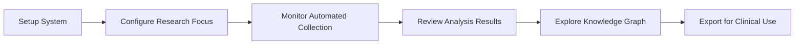

# 👥 User Guide

> **Complete guide to using the Compensation Research System**

## 🎯 Who This Guide Is For

### **🔬 Researchers**
- Academic researchers studying movement dysfunction
- Graduate students in biomechanics, kinesiology, or physical therapy
- Research assistants conducting literature reviews

### **🏥 Clinicians**
- Physical therapists treating movement disorders
- Sports medicine physicians
- Athletic trainers and movement specialists

### **💻 Developers**
- Software developers building research tools
- Data scientists working with academic literature
- System integrators connecting research systems

## 🚀 Getting Started

### **Quick Start (5 Minutes)**
1. **[Install System](../installation.md)** - Get up and running
2. **[Run First Analysis](#first-analysis)** - Analyze a sample paper
3. **[Explore Results](#exploring-results)** - Navigate the generated vault
4. **[Customize Settings](#customization)** - Adapt to your needs

### **Complete Workflow**


## 📖 Core Concepts

### **5WHY Methodology**
The system uses a systematic 5-level approach to understand compensation:

```
Level 1: Clinical Symptom
   ↓
Level 2: Primary Dysfunction
   ↓
Level 3: Functional Origin
   ↓
Level 4: Neuromotor Adaptation
   ↓
Level 5: System Integration
```

**Learn more**: [5WHY Framework](../research/5why-framework.md)

### **Compensation Patterns**
The system identifies recurring patterns of movement compensation:

- **Substitution**: One muscle replaces another's function
- **Overflow**: Adjacent structures assist compromised function
- **Adaptation**: System-wide modifications to maintain function
- **Protection**: Movement modifications to avoid pain/injury

### **Knowledge Graph**
All analyses are connected in a network that reveals:
- **Causal relationships** between dysfunctions
- **Treatment pathways** for specific patterns
- **Assessment strategies** for identification
- **Prevention approaches** for high-risk populations

## 🔧 System Operation

### **Automated Mode (Recommended)**
The system runs automatically every 10 minutes via GitHub Actions:

```yaml
Automatic Process:
1. Screen new papers from academic databases
2. Filter for high-quality compensation research
3. Perform 5WHY analysis on selected papers
4. Connect findings to existing knowledge graph
5. Generate/update Obsidian vault pages
6. Commit results to repository
```

**Monitor Progress**: Check the Actions tab in your GitHub repository

### **Manual Mode**
For on-demand analysis or testing:

```bash
# Analyze specific papers
python compensation_research_system.py --single

# Screen papers only
python paper_screener.py

# Analyze existing paper
python why_analyzer.py --paper-id "openalex:W1234567890"

# Generate vault content
python obsidian_generator.py
```

## 📊 Understanding Results

### **Generated Content Structure**
```
Compensation-Research-Vault/
├── 01-Papers/                    # Individual paper analyses
│   ├── Hip-Compensation/
│   ├── Knee-Compensation/
│   └── Ankle-Compensation/
├── 03-Compensation-Patterns/     # Identified patterns
│   ├── Primary-Patterns/
│   └── Secondary-Adaptations/
├── 07-Graphs/                    # Network visualizations
└── 08-Meta/                      # System statistics
```

### **Paper Analysis Files**
Each paper gets its own detailed analysis:

```markdown
# Paper Title

## Study Overview
- Journal: Physical Therapy (2023)
- Quality Score: 8.5/10
- Study Type: Randomized Controlled Trial

## 5WHY Analysis
### 1차 WHY: Why does this dysfunction occur?
**Answer**: Gluteus medius weakness leads to hip instability
**Evidence**: EMG showed 40% reduction in activation

[... continues through all 5 levels ...]

## Compensation Pattern
**Pattern**: Hip Abductor Weakness → TFL Overactivity
**Clinical Significance**: Very common in runners

## Treatment Implications
- Primary: Gluteus medius strengthening
- Secondary: TFL stretching and release
```

### **Pattern Recognition**
The system automatically identifies and documents recurring patterns:

```markdown
# Gluteus Medius Weakness Pattern

## Overview
Highly prevalent compensation pattern affecting 65% of PFPS cases

## Causal Chain
Weakness → Instability → TFL Substitution → IT Band Tension → Lateral Knee Pain

## Clinical Indicators
- Positive Trendelenburg sign
- Excessive hip adduction during squats
- TFL overactivity on EMG

## Treatment Protocol
[Evidence-based intervention recommendations]
```

### **Knowledge Connections**
The system creates intelligent links between related concepts:

```markdown
# Connections for "Gluteus Medius Weakness"

## Related Dysfunctions
- [[Hip Abductor Weakness]]
- [[Core Instability]]
- [[Ankle Instability]]

## Compensatory Patterns
- [[TFL Overactivity]]
- [[Hip Hiking Pattern]]
- [[Contralateral Pelvic Drop]]

## Assessment Methods
- [[Trendelenburg Test]]
- [[Single Leg Squat Assessment]]
- [[EMG Analysis]]

## Treatment Approaches
- [[Progressive Strengthening Protocol]]
- [[Motor Control Training]]
- [[Functional Movement Retraining]]
```

## 🎛️ Customization

### **Research Focus Areas**
Configure the system to focus on specific body regions or conditions:

```bash
# Edit configuration
nano .env

# Set focus areas
RESEARCH_FOCUS_AREAS=hip,knee,ankle
PREFERRED_JOURNALS=Physical Therapy,JOSPT,Clinical Biomechanics
QUALITY_THRESHOLD=7.0
```

### **Analysis Depth**
Adjust the thoroughness of analysis:

```python
# In compensation_research_system.py
config = {
    "paper_limit_per_cycle": 5,    # Papers analyzed per 10-min cycle
    "quality_threshold": 7.0,      # Minimum quality score (0-10)
    "why_depth_target": 5,         # Target depth for 5WHY analysis
    "connection_threshold": 0.6    # Minimum strength for node connections
}
```

### **Output Customization**
Modify the generated content format:

```python
# In obsidian_generator.py
vault_config = {
    "include_abstracts": True,
    "generate_summaries": True,
    "create_index_pages": True,
    "add_visual_diagrams": False,
    "link_to_original_papers": True
}
```

## 🔍 Monitoring & Troubleshooting

### **System Health Checks**
```bash
# Check overall system health
python scripts/health_check.py

# View detailed logs
tail -f logs/compensation_research.log

# Check component status
python test_integration.py
```

### **Common Issues**

#### **No New Papers Found**
```bash
# Check API connectivity
curl -s "https://api.openalex.org/works?search=compensation" | head

# Verify filter settings aren't too restrictive
python paper_screener.py --debug
```

#### **Analysis Quality Issues**
```bash
# Review quality thresholds
grep "quality_threshold" .env

# Check 5WHY completeness
python why_analyzer.py --validate-analysis
```

#### **GitHub Actions Not Running**
1. Check workflow file syntax in `.github/workflows/`
2. Verify repository permissions (Actions → General → Permissions)
3. Review Actions tab for error messages

### **Performance Optimization**
```bash
# Clear old cache data
rm -rf .cache/

# Optimize memory usage
python scripts/performance_optimizer.py optimize

# Review system metrics
python scripts/performance_optimizer.py report
```

## 📈 Advanced Usage

### **Batch Processing**
Process multiple papers at once:

```python
# Bulk analysis script
from paper_screener import CompensationPaperScreener
from why_analyzer import CompensationWhyAnalyzer

screener = CompensationPaperScreener()
analyzer = CompensationWhyAnalyzer()

# Get papers from specific journal
papers = screener.search_papers_by_journal("Physical Therapy", limit=20)

# Analyze all papers
for paper in papers:
    analysis = analyzer.analyze_paper(paper)
    print(f"Analyzed: {paper['title']}")
```

### **Custom Research Questions**
Focus on specific research questions:

```python
# Custom search queries
search_queries = [
    "gluteus medius AND compensation AND running",
    "serratus anterior AND scapular dyskinesis",
    "tibialis posterior AND foot pronation"
]

for query in search_queries:
    papers = screener.search_papers(query=query, limit=10)
    # Process papers...
```

### **Integration with Other Tools**
```python
# Export data for external analysis
import json

# Export knowledge graph
graph_data = node_connector.export_graph_data()
with open('compensation_network.json', 'w') as f:
    json.dump(graph_data, f, indent=2)

# Export paper database
paper_database = screener.export_paper_database()
with open('compensation_papers.csv', 'w') as f:
    paper_database.to_csv(f, index=False)
```

## 📞 Getting Help

### **Documentation Resources**
- **[Installation Guide](../installation.md)**: Setup and deployment
- **[API Reference](../api/README.md)**: Programmatic access
- **[Architecture Overview](../architecture/system-overview.md)**: System design
- **[5WHY Framework](../research/5why-framework.md)**: Analysis methodology

### **Community Support**
- **GitHub Issues**: Bug reports and feature requests
- **GitHub Discussions**: Questions and general discussion
- **Email Support**: research@compensation.ai

### **Professional Services**
- **Custom Integration**: Tailored system integration
- **Training Workshops**: Team training on 5WHY methodology
- **Consulting**: Research design and implementation support

---

**🎯 Next Steps**: Choose your path based on your role:
- **Researchers**: Start with [Research Methodology](../research/5why-framework.md)
- **Clinicians**: Explore [Clinical Applications](clinical-applications.md)
- **Developers**: Check out the [API Reference](../api/README.md)